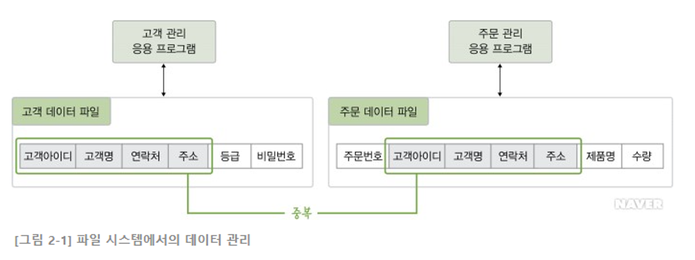

## 파일시스템과 데이터베이스의 차이점

### 파일시스템

- 과거에는 데이터를 관리하기 위해 파일시스템이라는 소프트웨어를 사용했다.
- 파일 시스템은 데이터를 파일로 관리할 수 있도록 파일을 생성, 삭제, 수정, 검색하는 기능을 제공하고 운영체제와 함께 설치된다.
- 파일 시스템은 **응용프로그램별로 필요한 데이터를 별도의 파일로 관리**한다. 이러한 특성은 아래와 같은 문제점을 가지고 있다.

  - **데이터 중복** : 같은 내용의 데이터가 여러 파일에 중복 저장된다.
    - 위 그림을 보면, 두 응용 프로그램에서 고객아이디, 고객명, 연락처, 주소 등의 데이터가 중복된다.
    - **데이터가 중복되면, 저장공간이 낭비되고 데이터의 일관성과 무결성을 유지하기 어려워진다.**
      - 일관성 문제 : 예를 들어 고객관리 응용프로그램으로 고객 데이터 파일에 어떤 고객 연락처 정보를 수정했다. 그런데 주문 데이터 파일은 수정되지 않았다면, 데이터 불일치가 발생한다.
      - 무결성 문제 : 예를 들어, 고객 아이디는 영어와 숫자가 섞이고 5자 이상이어야 하는 조건이 있을 때 이것을 모든 응용 프로그램에서 확인해야한다. 데이터가 여러 파일에 중복되어 통제가 어려운 환경에서는 데이터 정확성 문제가 빈번히 발생할 수 있다.

  - **데이터 종속** : **응용 프로그램이 데이터 파일에 종속적이다.**
    - 응용 프로그램은 파일에 직접 접근하여 데이터를 처리해야하므로 사용하는 파일의 데이터를 구성하는 방법에 종속된다.
    - 즉, 사용하는 파일의 구조를 변경하면 응용 프로그램도 함께 변경해야한다.
  
  - **데이터 파일에 대한 동시 공유, 회복 기능이 부족하다.**
    - 동시 사용 불가 : 일반 파일 시스템에서는 응용 프로그램 하나가 사용중인 파일을 다른 응용 프로그램이 접근하여 사용할 수 없다.
    - 보안 부족 : 파일 시스템은 보통 파일 단위로 읽기, 수정, 실행 권한을 부여하는 식으로 데이터 접근을 통제한다. 하지만 파일안의 레코드나 필드와 같은 더 작은 단위에 대한 통제와 접근 보안이 필요하다.
    - 회복 부족 : 파일시스템에서 응용프로그램이 파일을 사용하는 도중에 장애가 발생하면, 데이터를 일관된 상태로 회복하기 어렵다. 특히 데이터를 수정하는 도중에 장애가 발생한 경우는 어렵다.

## 데이터베이스의 특징

- 데이터베이스 정의
  - 특정 조직의 여러 사용자들이 공유해서 사용할 수 있도록 통합해 저장한 **운영 데이터**의 집합
    - 운영 데이터
      - 조직의 주요 기능을 수행하기 위해 반드시 필요한 운영 데이터

- 데이터베이스 특징
  - 실시간 접근성
    - 사용자의 질의에 대하여 즉시 처리하여 응답하는 특징
  - 계속 변화
    - 삽입, 삭제, 갱신을 통하여 항상 최근의 정확한 데이터를 동적으로 유지하는 특징
  - **동시 공유**
    - **여러 사용자가 동시에 원하는 데이터를 공유할 수 있는 특징**
  - 내용에 의한 참조
    - 데이터베이스에 있는 데이터를 참조할 때 튜플의 주소나 위치에 의해서가 아니라, 사용자가 요구하는 데이터 내용에 따라 참조하는 특징

| 파일 시스템 | DBMS |
| --- | --- |
| 데이터에 대한 물리적 접근만 조정한다. | 데이터에 대한 물리적 접근과 논리적인 접근을 모두 조정한다. |
| **동일한 파일을 두개 이상의 프로그램이 동시에 접근할 수 없다.** | **동일한 데이터를 다수 사용자가 동시에 접근할 수 있다.** |
| **데이터가 비구조적**이며, 중복성과 유지보수 비용이 높다. | **데이터가 구조적**이며, 중복성과 유지보수 비용이 낮다. |
| 어떤 프로그램이 기록한 데이터는 다른 프로그램에서 읽을 수 없는 경우가 많다. | 접근 권한이 있는 모든 프로그램이 데이터를 공유한다. |
| 데이터에 대한 접근은 미리 작성된 프로그램을 통해서만 가능하다. | 질의어를 사용하여 데이터에 대한 융통성 있는 접근이 가능하다. |
| **각 응용 프로그램마다 파일이 따로 있으므로 데이터가 통합되어 있지 않다.** | **데이터가 중복을 배제하면서 통합되어있다.** |

- 참조블로그
  - https://kylo8.tistory.com/entry/DB-%ED%8C%8C%EC%9D%BC-%EC%8B%9C%EC%8A%A4%ED%85%9C%EA%B3%BC-DBMS%EC%9D%98-%EC%B0%A8%EC%9D%B4-%EB%8D%B0%EC%9D%B4%ED%84%B0-%EA%B4%80%EB%A6%AC-%EC%8B%9C%EC%8A%A4%ED%85%9C