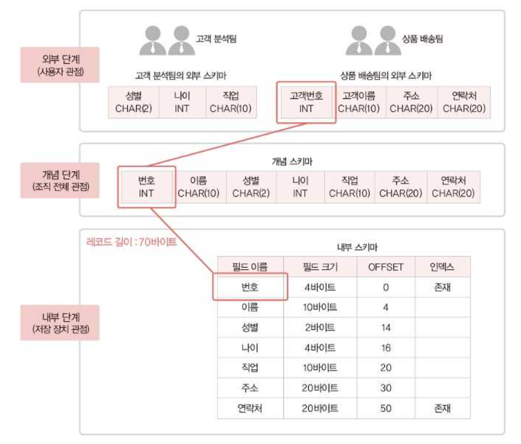

## DBMS의 개념과 특징

- DBMS(DataBase Management System, DBMS)는 데이터베이스를 조작하는 별도의 소프트웨어이다.

- 데이터 무결성
  - 부적절한 자료가 입력되어 동일한 내용에 대해 서로 다른 데이터가 저장되는 것을 허용하지 않는 성질
- 데이터 일관성
  - 삽입, 삭제, 갱신, 생성 후에도 저장된 데이터가 모순이 없고 동일한 규칙내에 일정해야하는 성질
- 데이터 회복성
  - 장애가 발생했을때 특정 상태로 복구되어야하는 성질
- 데이터 보안성
  - 불법적인 노출과 변경으로부터 보호하는 성질
- 데이터 효율성
  - 응답시간, 저장공간 활용들이 최적화되어야하는 성질

## 스키마의 개념과 3단계 데이터베이스 구조

### 스키마(Schema)
- 데이터베이스에 저장되는 데이터 구조와 제약조건을 정의한 것

### 3단계 데이터베이스 구조

- 3단계 데이터베이스 구조는 하나의 데이터베이스를 외부, 개념, 내부 세 단계로 나눈 것이다.
- 일반적으로 **내부단계에서 외부 단계로 갈수록 추상화 레벨이 높아진다.**
  - 추상화 레벨이 높아진다는 것은 데이터베이스가 실제 어떻게 돌아가는지 알 필요가 없음을 의미한다.

- **외부단계**
  - 데이터베이스를 **개별 사용자 관점**에서 이해하고 표현한다. 외부 단계에서 사용자에게 필요한 데이터베이스를 정의한 것을 외부 스키마라고 한다.

- **개념단계**
  - 데이터베이스를 이용하는 사용자들의 관점을 통합해 **조직 전체의 관점**에서 이해하고 표현한다.
  - 모든 사용자에게 필요한 데이터를 통합하여 전체 데이터베이스의 논리적 구조를 정의하는데 이를 개념스키마라고 한다.

- **내부단계**
  - 데이터베이스를 **저장장치의 관점**에서 이해하고 표현한다. 
  - 전체 데이터베이스가 디스크와 테이프같은 저장장치에 실제로 저장되는 방법을 정의하는데 이를 내부스키마라고 한다.