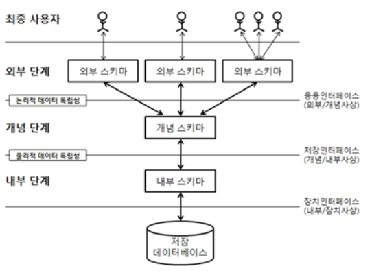

## 데이터 독립성

- 논리적 데이터 독립성
  - 외부스키마와 개념스키마 사이의 독립성
  - 개념스키마가 변경되어도 외부스키마에는 영향을 미치지 않도록 지원한다.
    - 예를 들어, 우리가 카카오톡에서 친구들 목록을 본다고 가정하자. 이때 카카오 선물의 빼빼로 가격이 1000원 올랐다고 하여도 우리가 직접 다루고 있는 테이블이 아니기 때문에 영향을 주지 않는다.
    - 이렇듯, 우리가 보는 외부스키마와 개념스키마가 서로 영향을 주지 않게 분리해 놓은 것을 논리적 데이터 독립성이라고 한다.

- 물리적 데이터 독립성
  - 개념스키마와 내부 스키마 사이의 독립성
    - 내부스키마가 변경되어도 개념 스키마에 영향을 미치지 않도록 지원한다.
      - 예를 들어, 우리가 공간 효율성을 위해 VARCHAR(100)의 주소라는 속성을 VARCHAR(50)으로 바꾼다고 가정할때, 우리가 주소의 크기를 줄여도 개념스키마에는 영향을 주지 않는데 이를 물리적 데이터 독립성이라고 한다.

- 참조블로그
  - https://mangkyu.tistory.com/19

## RDBS(관계형 데이터베이스 관리시스템)의 개념

- 관계형 모델을 기반으로 하는 DBMS유형이다.
  - 관계형 모델 : 실제 세계의 데이터를 '관계'라는 개념을 사용해서 표현한 데이터 모델
- **데이터를 테이블 단위로 관리하는, 테이블 기반의 DBMS**
- **RDBMS의 테이블은 서로 연관되어있어 일반 DBMS보다 효율적으로 데이터를 저장, 구성 및 관리할 수 있다.**
- 정규화를 통해 데이터의 중복성을 최소화하며 트랜잭션을 수행하는 것이 더 쉽다.
- RDBMS는 DBMS의 한 유형이다.