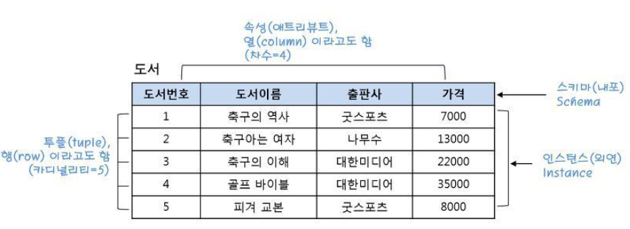

## 릴레이션 스키마와 릴레이션 인스턴스 개념

- 릴레이션은 스키마와 인스턴스로 이루어진다.
- 릴레이션 스키마
  - 릴레이션에 어떤 정보가 담길지를 정의한다. 
  - 도서 릴레이션은 도서번호, 도서이름, 출판사, 가격이라는 정보를 정의하고 있는데, 각 열을 속성이라고 한다.
- 릴레이션 인스턴스
  - 릴레이션 스키마에 실제로 저장된 데이터의 집합이다.
  - 도서 릴레이션을 보면 도서 번호가 1부터 5까지 총 다섯 권의 데이터가 저장된 것을 알 수 있다.
  - 릴레이션에서 각 행을 튜플이라고 한다.

## 릴레이션의 차수와 카디널리티
- 차수 : 속성의 개수
- 카디널리티 : 튜플의 개수