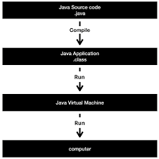

## java동작 과정
Java Source code(.java)를 Compile하게 되면
-> .class로 변환이 됨(.class = Java Application)
-> 이클립스 혹은 인텔리제이에서 RUN을 하게 되면, JVM은 .class파일을 실행(RUN)시키게 된다.

- 참조사이트 
  - https://www.youtube.com/watch?v=9V0rdrm59X4

