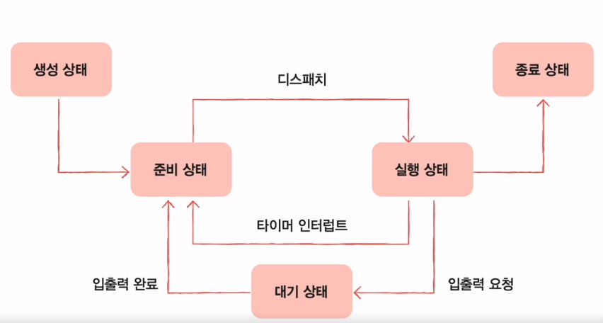
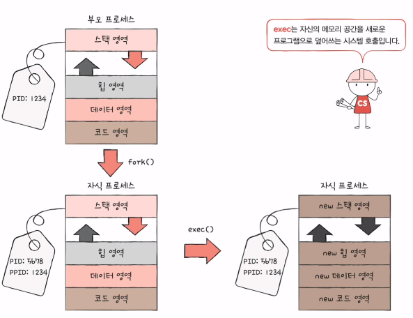

## 프로세스 상태
- 아래의 프로세스 상태들은 PCB에 저장된다.

- 생성 상태(created)
  - 이제 막 메모리에 적재되어 PCB를 할당받은 상태
- 준비 상태(ready)
  - 당장이라도 CPU를 할당받아 실행할 수 있지만, 자신의 차례가 아니기에 기다리는 상태
  - 자신의 차례가 된다면 실행상태(=디스패치)로 변함
- 실행 상태(running)
  - cpu를 할당받아 실행중인 상태
  - 할당된 시간 모두 사용시 (=즉, 타이머 인터럽트 발생 시), 준비상태로 돌아간다.
  - 프로세스를 실행 도중 입출력장치를 사용하면, 입출력작업이 끝날 때까지 대기 상태로 
- 대기 상태(blocked)
  - 프로세스가 실행 도중 입출력장치를 사용하는 경우
  - 입출력 작업은 CPU에 비해 느리기에, 이 경우 대기상태로 접어듬
  - 입출력 작업이 끝나면 (=입출력 완료 인터럽트를 받으면), 준비 상태로 
- 종료 상태(terminated)
  - 프로세스가 종료된 상태로, 프로세스에게 할당된 PCB, 프로세스의 메모리 영역을 페기함

## 프로세스 계층구조
- 윈도우는 해당안되고 리눅스, 유닉스 등이 해당됨
- 프로세스 실행 도중, 다른 프로세스를 생성할 수 있다.
- 이때, 부모 프로세스는 새 프로세스를 생성한 프로세스를 의미하며,
- 부모 프로세스에 의해 생성된 프로세스는 자식 프로세스를 의미한다.

**부모 프로세스와 자식 프로세스는 별개의 프로세스**이므로 **각기 다른 pid를 가진다.**
- 일부 운영체젱서는 자식 프로세스 PCB에 부모프로세스 PID(=PPID)를 명시하기도 한다.

## 부모 프로세스는 자식 프로세스를 어떻게 만들어내고, 자식프로세스는 어떻게 자신만의 코드를 실행할까?
- **결론 : 복제와 옷 갈아입기로 비유할 수 있다.**

- 부모 프로세스는 fork()라는 시스템콜을 통해 자신의 복사본을 자식 프로세스로 생성 (복제)
- 자식 프로세스는 exec()라는 시스템콜을 통해 자신의 메모리 공간을 다른 프로그램으로 교체 (옷 갈아입기)

### fork()
- 부모프로세스의 자원을 상속받아 부모 프로세스와 같은 복사본을 자식프로세스로 생성한다.
  - 단, pid와 저장되어있는 메모리의 위치는 서로 다름! (서로 다른 프로세스니까!)

### exec()
- 자신의 메모리 공간을 새로운 프로그램으로 덮어쓰는 시스템 콜로,
- 코드/데이터 영역은 실행할 프로그램 내용으로 바뀌고 나머지 영역은 초기화 된다.

- 즉, 부모프로세스가 fork()를 하여, 자신과 같은 프로세스를 만들게 되고(=자식프로세스)
- 자식프로세스가 실행하려고 하는 것을 실행하기 위해 exec()를 하게 된다.

- **이 결과, 부모프로세스가 갖고있는 프로그램의 내용과 자식프로세스가 갖고있는 프로그램의 내용이 다르게 되어**
- **서로 다른 프로세스를 실행하는 것과 같다!**
- **프로세스의 계층 구조를 이루는 것은 fork()와 exec()가 반복되는 과정과 같다!**

- exec()이 반드시 실행되는 것은 아니고, fork()만 실행되는 경우도 있음!

