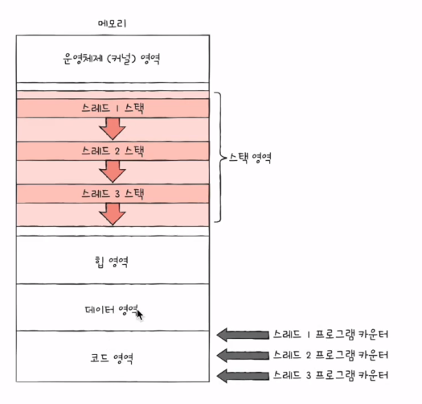
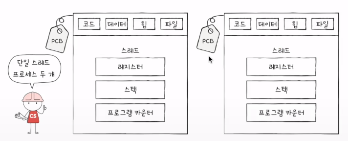
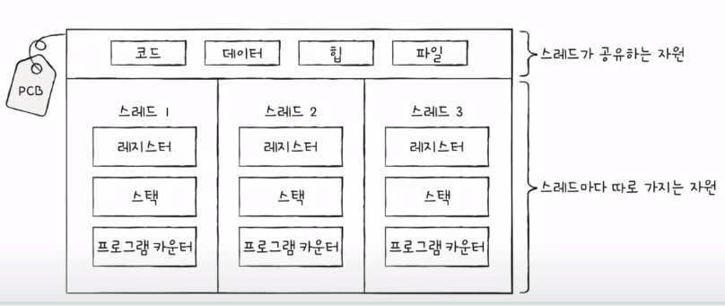

## 스레드?
- **프로세스를 구성하는 실행 흐름의 단위**
- 하나의 프로세스는 하나이상의 스레드를 가질 수 있다

- 단일 스레드 프로세스 : 실행 흐름이 하나인 프로세스
- 멀티 스레드 프로세스 : 실행 흐름이 여러개인 프로세스 (최근)
  - 프로세스를 이루는 여러 명령어(여러 스레드)를 동시에 실행할 수 있다!

- 스레드의 구성요소
  - 스레드 ID, 프로그램 카운터를 비롯한 레지스터값, 스택 등
  - 스레드 마다 **실행에 필요한 최소한의 정보**를 가지고 있다.

- 프로세스를 이루는 스레드들은 프로세스의 자원을 공유하며 실행된다.
  - 코드영역이 스레드마다 있는 것이 아니라, 위 그림과 같이, 하나의 코드영역을 여러개의 스레드가 공유하고 있는 것임!

## 멀티프로세스와 멀티스레드의 차이를 정확히 이해하자!

- 멀티 프로세스 : 동일한 작업을 수행하는 **단일 스레드 프로세스**를 여러개 실행
- 멀티 스레드 : 하나의 프로세스를 여러 스레드로 실행

- 프로세스끼리는, 남남처럼 실행되면서 자원을 공유하지 않지만, 
- 스레드끼리는 같은 프로세스내의 자원을 공유하며 실행된다.
- 위 그림 양쪽 모두 "hello, os"가 3번 출력됨.
- 왼쪽그림(멀티프로세스)은, 세번 fork()한 것으로, fork()는 code/data/heap영역 등 모든 자원이 복제되어 저장된다.
  - = 저장된 메모리 주소를 제외하면, 모든 것이 동일한 프로세스 세개(=단일 스레드 프로세스3개)가 통째로 메모리에 적재됨.
- 오른쪽그림(멀티스레드)는 프로세스의 자원을 공유하며 실행됨.

## but, 프로세스 간에도 자원을 공유할 수 있음(IPC)
- 파일을 통한 프로세스 간 통신, 공유 메모리를 통한 프로세스 간 통신