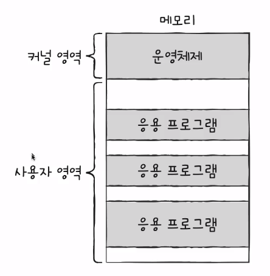

## 운영체제란 무엇이고, 어떤 역할을 수행하는가?

### 운영체제란?

- 실행할 프로그램에 필요한 자원을 할당하고, 각 프로그램이 올바르게 실행되도록 돕는 **프로그램**
- 운영체제도 프로그램이기 때문에 메모리에 적재되어서 실행된다.
- 이때, 운영체제가 메모리에 적재되는 영역을 **커널 영역**이라고 한다.
- **응용프로그램과 하드웨어의 중간매개체** 

### 운영체제의 역할

- 메모리 관리 - 어떤 프로그램을 어느 곳에 적재시킬지
- CPU 관리 - 어떤 프로그램을 먼저, 얼마동안 CPU를 사용하도록 할지 
- 입출력장치 관리