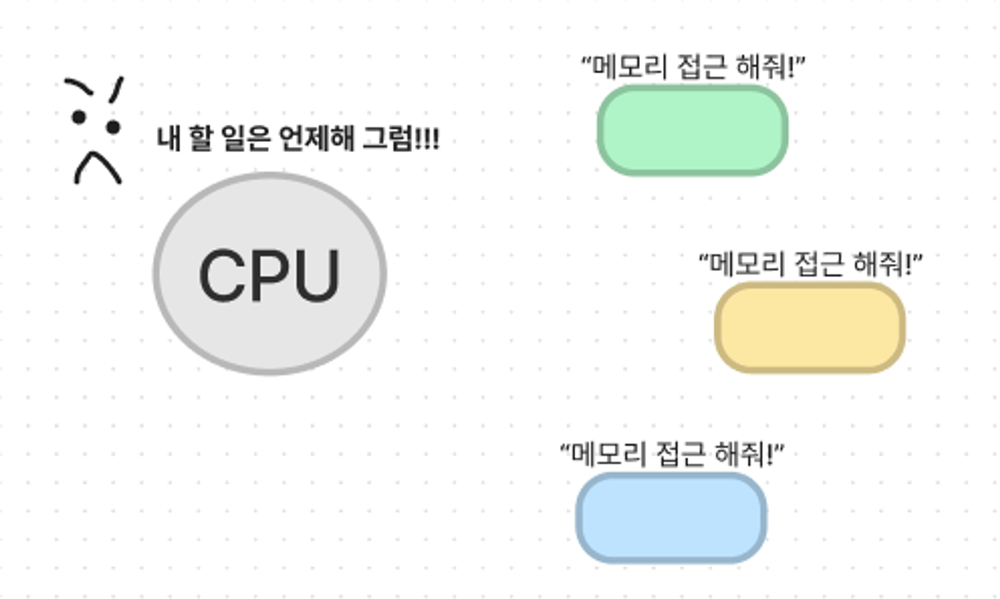

## DMA(Direct Memory Access)
- 원칙적으로 **메모리는 cpu에 의해서만 접근할 수 있는 장치**이다.
- 따라서 CPU외의 장치가 메모리에 접근하기 위해서 CPU에게 인터럽트를 발생시켜 CPU가 이를 대행하는 식으로만 가능하다.
- 하지만, 모든 메모리 접근 연산이 cpu에 의해서만 이루어질 경우, 입출력 장치가 메모리 접근을 원할때마다 인터럽트에 의해 CPU의 업무가 방해를 받게되어
- CPU사용의 효율성이 저하되는 문제가 발생한다.

- 이러한 비효율성을 cpu외에 메모리 접근이 가능한 장치를 하나 더 두는 경우가 많은데, 이와 같은 장치를 DMA(Direct Memory Access)라고 부른다.
- **DMA는 일종의 컨트롤러로, CPU가 입출력 장치들의 메모리 접근 요청에 의해 자주 인터럽트 당하는 것을 막아주는 역할을 한다.**
- **DMA를 사용하게 되면, 로컬 버퍼에서 메모리를 읽어오는 작업을 CPU가 담당하는 것이 아니라, DMA가 대행한다.**
- I/O장치들은 로컬 버퍼를 가지고 있고, 이를 통해 cpu에게 알려주면, cpu가 직접 버퍼에 있는 내용을 자신의 메모리로 카피해 가져간다.
- DMA는 입출력장치에 의한 인터럽트가 자주 걸리는 것을 막기 위해 아주 작은 크기의 데이터가 I/O로컬 버퍼에 들어가 있다면, 특정 블록 단위까지 찼을때까지 기다렸다가 
- DMA가 직접 메모리에 카피해주는 작업까지 해준다. 그 뒤, cpu한테 인터럽트를 거는 방식으로 작동하여 보다 더 인터럽트의 횟수를 낮출 수 있다.

- 결과적으로, DMA를 통해 CPU에게 발생하는 인터럽트 발생 빈도를 줄여 CPU의 효율적인 관리와 빠른 입출력 연산을 수행할 수 있다.

- 참고자료
  - https://velog.io/@ddongpuri/3장-컴퓨터-시스템의-동작-원리
  - https://ksk-developer.tistory.com/m/40