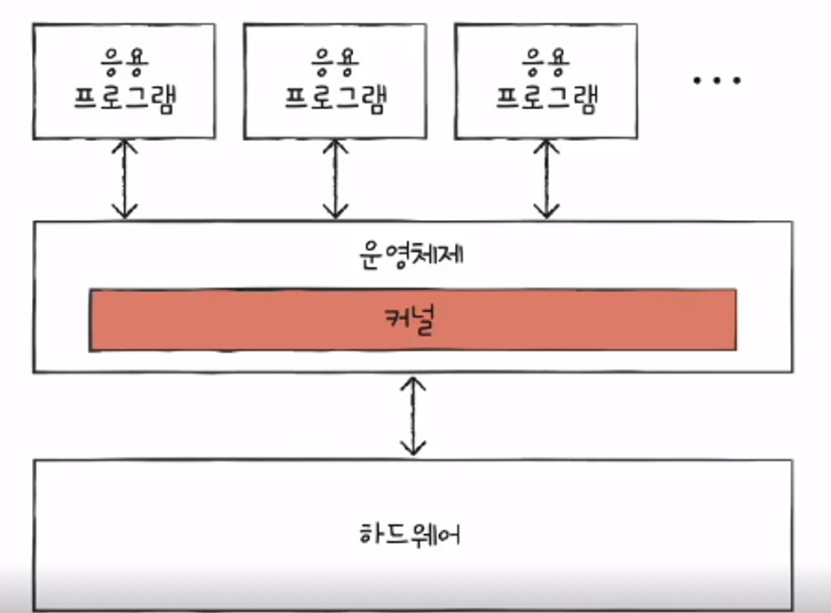
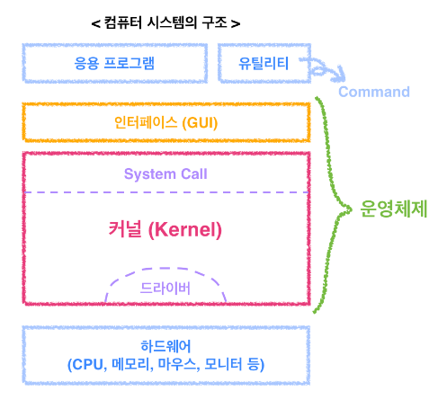

## 커널이란?

- 자동차의 엔진, 사람의 심장처럼, 운영체제의 '핵심 서비스'를 담당하는 부분
- 컴퓨터가 부팅하는 순간, 커널 코드가 메모리에 올라가고, **다른 프로그램과 다르게 항상 메모리에 상주한다.**

## 컴퓨터 시스템 구조

## 커널의 3가지 특성
- [자원을 보호하는 **보안성**](#1-보안성)
- [수많은 하드웨어가 접근가능하도록 하는 **추상화**](#2-추상화)
- [자원관리를 위한 **스케줄링**](#3-스케줄링)

### 1. 보안성
- 커널은 사용자나 응용프로그램으로부터 컴퓨터 자원을 보호하기 위해 자원에 직접 접근하는 것을 차단한다.
- 따라서 **사용자나 응용프로그램이 자원을 이용하기 위해서는 System Call**이라는 인터페이스를 이용하여 접근해야한다.
- System Call은 커널이 제공하는 시스템 관련 서비스를 모아넣은 것으로, **함수 형태로 제공한다.**
### 2. 추상화

- 응용프로그램과 커널의 인터페이스가 System Call이라면, 하드웨어와 커널의 인터페이스는 Driver가 담당한다.
- 커널이 많은 종류의 하드웨어마다 그에 맞는 인터페이스를 다 개발하기 힘들다. 
- 그래서 커널은 입출력의 기본적인 부분만 제작하고 하드웨어의 특성을 반영한 소프트웨어를 하드웨어 제작자에게 받아 커널이 실행될때 함께 실행되도록 하는데,
- 이것이 바로 Device Driver이다. 
- 즉, **하드웨어와 커널의 인터페이스는 Device Driver**라고 할 수 있다.

### 3. 스케줄링

- 자원은 한정되어이다. 한정된 자원을 여러 프로그램이 사용해야하는데, 어떠한 한 프로그램이 그 자원을 오랫동안 사용하고 있다면 다른 프로그램은 Ready Queue에서 계속 대기해야할 것이다.
- 그래서 **커널은 한정된 자원을 효율적으로 관리하여 프로그램의 실행을 원할하게 한다.**

