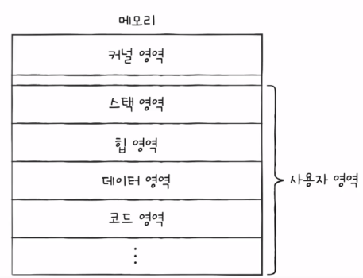
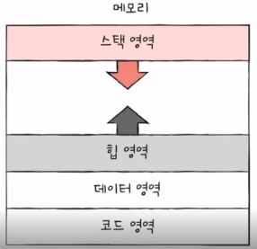

## 프로세스의 메모리 영역

- 사용자영역과 커널영역
  - 사용자 영역
    - 코드영역(=텍스트영역)
      - **실행할 수 있는 코드**, 기계어로 이루어진 명령어가 저장된다.
      - 데이터가 아닌, **CPU가 실행할 명령어**가 담기기에 쓰기가 금지된 Read-Only영역이다.
    - 데이터영역
      - 잠깐 썼다가 없앨 데이터가 아닌 **프로그램이 실행되는 동안 유지할 데이터**가 저장된다.
      - ex) 전역변수
    
    - **코드영역과 데이터 영역은 정적할당영역에 속한다.**
    
    - 힙 영역
      - 프로그래머가 직접 할당할 수 있는 저장공간
      - 낮은 주소 -> 높은주소로 할당된다.
    - 스택 영역
      - **데이터가 일시적으로 저장**되는 공간
      - 잠깐 쓰다가 말 값들이 저장되는 공간으로 
      - ex) 매개변수, 지역변수
      - 높은 주소 -> 낮은 주소로 할당된다.
    
    - **힙영역과 스택영역은 동적할당영역에 속한다.**

