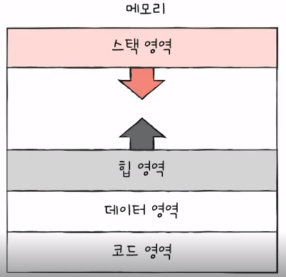

## 프로그램, 프로세스, 프로세스 주소공간, 스레드
### 프로그램
- 코드를 컴파일한뒤, 하드디스크에 저장한 것

### 프로세스
- 실행파일(프로그램)이 RAM메모리에 적재되어 cpu를 할당받아 실행하는 것으로, 즉 실행중인 프로그램을 의미한다.
- 운영체제로부터 자원을 할당받는 작업의 단위

### 프로세스 문맥

### 문맥 교환(context switch)
- 한 프로세스(A)에서 다른 프로세스(B)로 실행 순서가 넘어갔다고 가정하자.
  - 프로세스A는 지금까지의 중간정보인 문맥을 백업하게 되고 
  - 뒤이어 실행할 프로세스B의 문맥을 복구하게 된다.
- 이처럼, **기존의 실행중인 프로세스 문맥을 백업하고 새로운 프로세스 실행을 위해 문맥을 복구하는 과정을 Context Switch**라고 한다.

### 프로세스 주소공간
- code 
  - 실행한 프로그램의 코드가 저장되는 영역으로, Read-Only영역으로 되어있다.
  - 컴파일시에 결정된다.
- data
  - 전역변수, static변수가 저장되는 메모리 영역
  - 컴파일시에 결정된다.
  - 초기화된 데이터는 data영역에 저장이 되고, 초기화되지 않은 데이터는 bss(Block Stated Symbol)영역에 저장이 된다.
  - 실행도중에 변경될 수 있기때문에 Read-Write로 지정되어있다.
- stack
  - 전역변수, 매개변수가 저장되는 메모리 영역
  - 높은 주소 -> 낮은 주소로 할당된다.
  - 컴파일 시에 크기가 결정된다.
- heap
  - 런타임중에 크기가 결정되는 메모리 영역
  - 낮은 주소 -> 높은 주소로 할당된다.
- code, data는 정적할당영역 / stack, heap은 동적할당영역

### [참고] 커널 영역 메모리 구조
- 커널 영역은 code, data, stack, etc영역으로 나뉜다. (heap이 없음!)
- code영역 
  - 시스템 콜, 인터럽트 처리, cpu 및 memory등 자원관리제공을 위한 코드가 적재되어있다.
- data영역
  - pcb, cpu, memory와 같은 하드웨어 자원을 관리하기 위한 자료구조가 저장된다.
- stack영역
  - 각 프로세스의 커널 스택을 저장한다.

- 참고 블로그
  - https://shuu.tistory.com/80

### 커널은 힙 메모리가 없는건가요?
- 커널은 하나의 프로세스가 아니라 컴퓨터 하드웨어와 프로세스를 잇는 인터페이스로 힙 메모리를 사용하지 않는다.
- 운영체제에서 동적메모리 할당을 위해 필요한 기능들을 커널이 제공하는데, 커널에서 제공하는 기능을 사용해서 메모리 풀을 관리한다.

- 참고 블로그
  - https://zangzangs.tistory.com/107