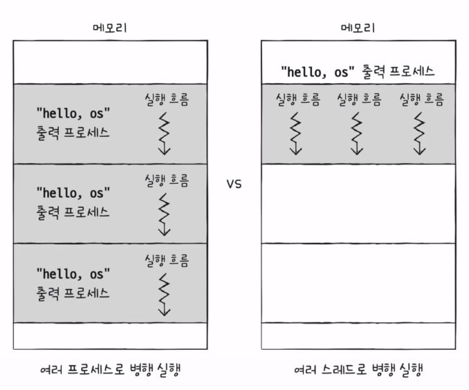

## 프로세스 제어블록(PCB), multi process?
### pcb
- **process가 현재 어떤 상태로 수행되고 있는지에 대한 총체적인 정보**를 **context**라고 하는데, **이러한 context정보는 pcb에 저장**한다.
- **pcb는 운영체제가 프로세스를 표현한 자료구조**로, pcb에는 프로세스의 중요한 정보가 있기때문에 일반사용자가 접근하지 못하도록 커널 메모리 영역안에 저장이 된다.
- **pcb는 커널의 위치**하며, 이 메모리 영역은 보호를 받으면서도 비교적 접근하기 편리하기 때문이다.

- pcb에 담기는 정보
  - **pid**
  - **레지스터 값**
    - **레지스터값이 pcb에 담기는 이유**
      - 프로세스는 자신의 실행차례가 오면, 이전까지 사용한 레지스터값을 복원하여 다시 실행을 재개하기 때문이다.
      - **즉, 자신의 실행차례가 오면, 이전까지 실행한 것을 재개하기 위해서!**
  - **프로세스 상태**
    - 실행, 준비, 봉쇄
      - running : 프로세스가 cpu를 점유하고 명령을 수행중인 상태
      - ready : cpu만 할당받으면 즉시 명령을 수행할 수 있는 상태
      - blocked : cpu를 할당받아도 명령을 수행할 수 없는 상태 (ex: i/o작업을 기다리는 경우)
  - **cpu스케줄링 정보**
  - 메모리 정보
  - 사용자 파일과 입출력파일 정보

### multi process
- 동일한 작업을 수행하는 **단일 스레드 프로세스를 여러개 실행**하는 것을 multi process라고 한다.
- 프로세스끼리는 남남처럼 실행되면서 **자원을 공유하지 않는다.**

### multi thread
- **하나의 프로세스를 여러 스레드로 실행**
- 스레드끼리는 같은 프로세스내의 **자원(code, data, heap)을 공유하며 실행**된다.

- 위 그림 양쪽 모두 "hello, os"가 3번 출력된다.
- 멀티 프로세스(왼쪽)
  - 멀티 프로세스는 세번 fork()한 것으로, fork()는 code, data, heap, stack영역 등이 모든 자원이 복제되어 저장된다.
  - 메모리 주소를 제외하면, 모든 것이 동일한 프로세스 3개가 메모리에 적재된다.
- 멀티 스레드(오른쪽)
  - 하나의 프로세스를 여러 스레드로 실행한다.
  - 프로세스의 자원을 공유하며 실행한다.