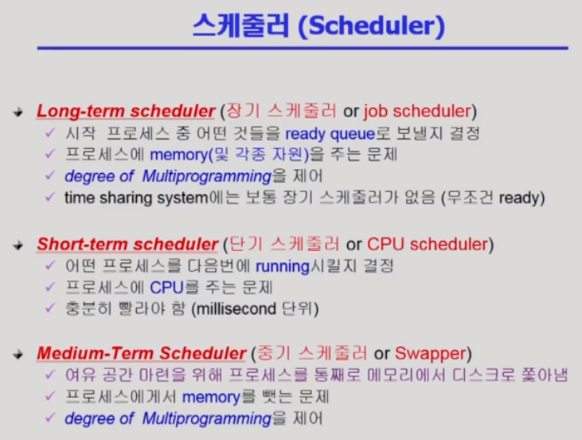

## 프로세스 수행 상태 변화과정

- new 상태
  - 프로세스가 시작되어 그 프로세스를 위한 자료구조는 생성되었지만, 아직 메모리 획득을 승인받지 못한 상태
- ready
  - 프로세스가 cpu를 할당받기를 기다리는 상태
  - 프로세스가 cpu를 점유하면 당장 명령을 수행하는 단계로, ready queue에 저장된다.
- running
  - 프로세스가 cpu를 할당받아 명령을 수행하는 상태
  - 한번에 하나의 프로세스만 실행가능
- blocked, sleep, wait
  - cpu를 할당받더라도 명령을 수행할 수 없는 프로세스 상태(ex: i/o작업을 기다리는 등)
  - waiting queue에 저장된다.
- **suspended blocked**
  - blocked상태에 있던 프로세스가 **중기 스케줄러에 의해 disk로 swap out(메모리를 뺏음)된다.**
- **suspended ready**
  - ready상태에 있던 프로세스가 **중기 스케줄러에 의해 disk로 swap out(메모리를 뺏음)된다.**
- terminated
  - 프로세스가 수행을 완료하거나 에러 등의 이유로 중단된 상태

- 참고블로그
  - https://velog.io/@yoonuk/%EC%9A%B4%EC%98%81%EC%B2%B4%EC%A0%9C-%ED%94%84%EB%A1%9C%EC%84%B8%EC%8A%A4-%EC%88%98%ED%96%89-%EC%83%81%ED%83%9C-%EB%B3%80%ED%99%94-%EA%B3%BC%EC%A0%95

### 중기 스케줄러(=Swapper)
- 메모리가 부족한 상황에서, 여유공간마련을 위해 프로세스를 통째로 메모리에서 디스크로 쫓아낸다.
- 즉, 프로세스에서 memory를 뺏는 것을 중기스케줄러가 담당한다.

### blocked와 suspended의 차이

suspended는 외부에서 resume해줘야 active가 되고, blocked는 자신이 요청한 event가 만족되면 ready가 된다.
