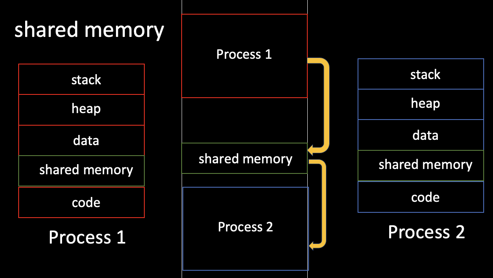
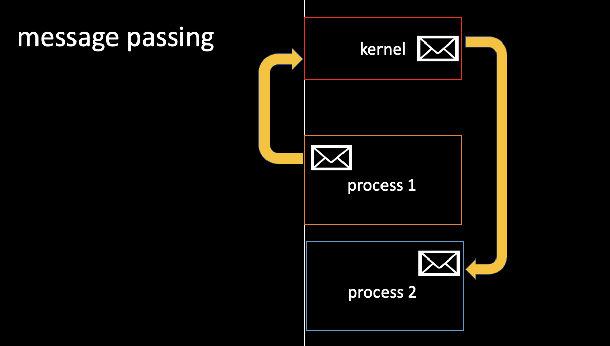

## 프로세스끼리 협력하는 방법

- IPC(Interprocess Communication)는 협력 프로세스 사이에서 서로 데이터를 주고 받는 방법을 의미한다.

- IPC에는 크게 두가지 모델로 나뉜다.
  - Shared Memory
    - 서로 다른 프로세스 간에 일부 주소 공간을 공유하여 데이터를 주고받는 방식을 의미한다.
    - 프로세스가 공유 메모리 할당을 커널에 요청하면, 커널은 해당 프로세스에 메모리 공간을 할당해준다.
    - **공유메모리 영역이 구축된 이후에는 모든 접근이 일반적인 메모리 접근으로 취급되기 때문에** **더 이상 커널의 도움없이도 각 프로세스들이 해당 메모리 영역에 접근할 수 있다.**
    - 공유 메모리 방식은 프로세스 간의 통신을 수월하게 만들지만, 동시에 같은 메모리 위치에 접근하게 되면 **일관성 문제가 발생**할 수 있다.
    - 커널은 이 부분에 대해 전혀 관여하지 않기때문에 프로세스끼리 직접 공유 메모리 접근에 대한 **동기화문제를 책임**져야한다.

  - Message passing
    - message passing방법은 통신 system call을 사용하여 구현된다.
    - **커널을 통해 send와 receive라는 두 가지 연산을 제공한다.**
    - 예를 들어, 프로세스1이 커널로 메시지를 보내면, 커널이 프로세스2에게 메시지를 보내주는 방식으로 동작한다.
    - shared memory보다는 속도가 느리지만, 충돌을 회피할 필요가 없기때문에 적은 양의 데이터를 교환하는데 유용하며 구현하기 쉽다는 장점을 갖는다.

- 공유메모리와 메시지 전달 모델의 장단점?
  - **shared memory는** 초기에 공유 메모리 할당을 제외하면 **커널의 관여없이 통신할 수 있기 때문에 속도가 빠르다.**
  - 하지만, 여러 프로세스가 동시에 메모리에 접근하는 문제가 발생할 수 있어서 **별도의 동기화 과정이 필요하다는 단점**이 있다.
  - **message passing**은 **커널을 통해서 데이터를 주고 받기 때문에 통신속도가 느리다**는 단점이 있지만,
  - **커널에서 제어를 해주기 때문에 안전하고 동기화를 제공**해준다는 장점이 있다.