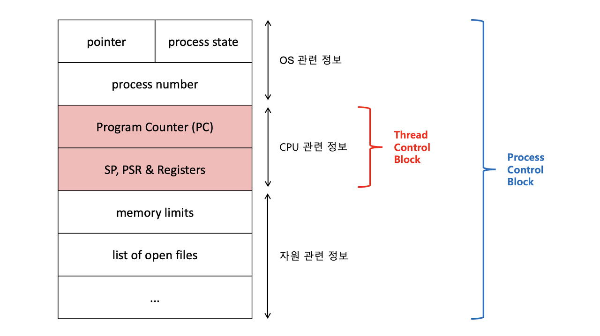
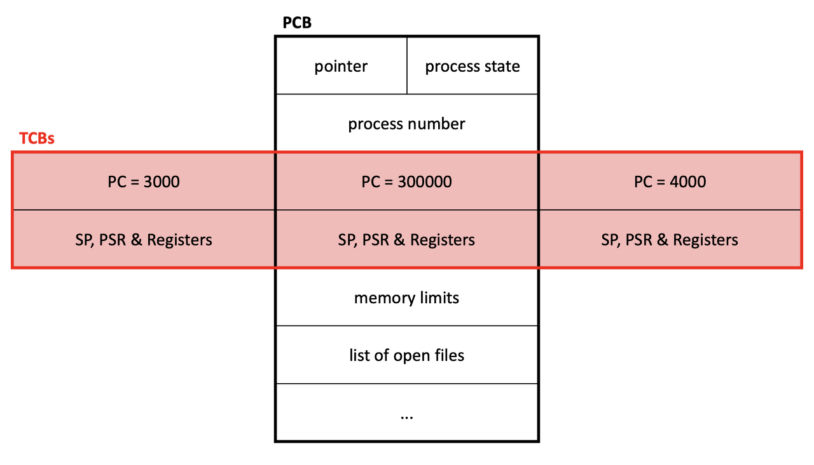
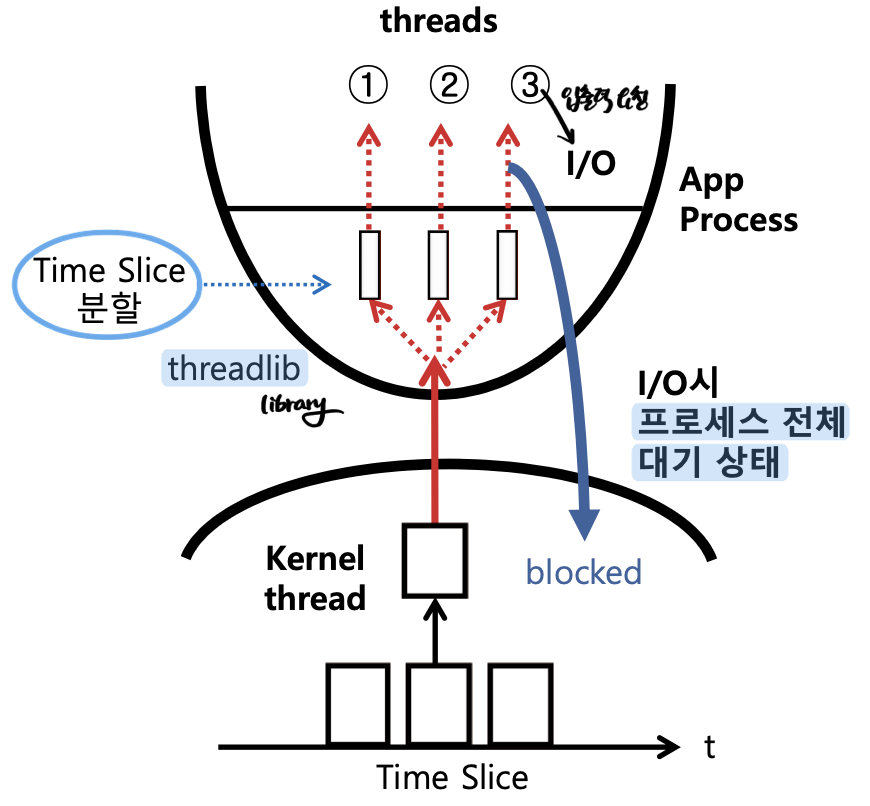
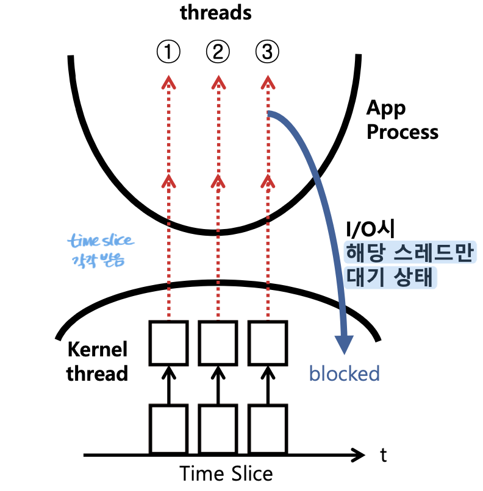
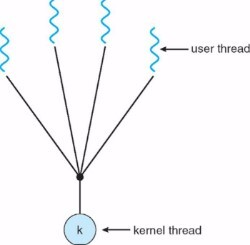
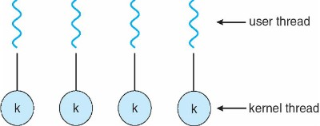
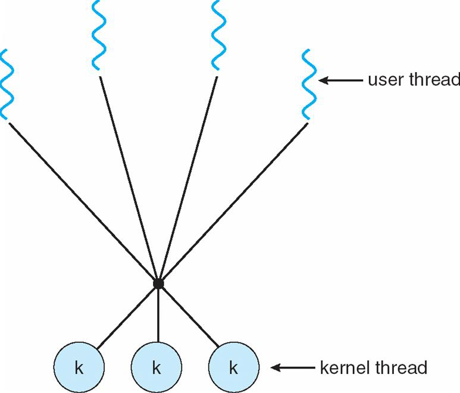
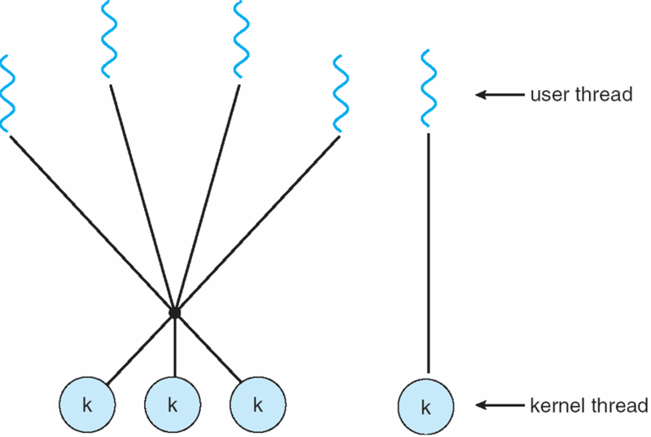

### 스레드
- 프로세스 안에서 실행되는 흐름의 단위로, stack영역을 제외한 나머지 영역을 공유하게 된다.
- **stack을 스레드마다 독립적으로 할당하는 이유?**
    - stack은 함수 호출시, 전달되는 인자, 되돌아갈 주소값 및 함수 내에서 선언하는 변수 등을 저장하기 위해 사용되는 메모리 공간을 의미한다.
    - stack메모리 공간이 독립적이라는 것은, 독립적인 함수 호출이 가능하다는 것이고, 이것은 곧 독립적인 실행흐름을 추가되는 것을 의미한다.
    - 따라서, **스레드의 정의에 따라 독립적인 실행흐름을 추가하기 위해서 최소 조건으로 독립된 stack을 할당한다.**
- 장점
    - 시스템의 처리량이 향상된다.
- 단점
    - 여러개의 스레드를 이용하는 프로그램을 작성하는 경우에는 critical section을 잘 관리하여 **여러 스레드가 함꼐 공유 자원을 이용하는데 오류가 없도록 해야한다.**

### 스레드를 사용하는 이유?
- **멀티프로세스로 실행되는 작업을 멀티 스레드로 실행하게 되면, 프로세스를 생성하여 자원할당하는 과정도 줄어들고**
- **멀티프로세스로 context-switching하는 것보다 멀티스레드로 context-switching하는 것이 오버헤드를 더 줄일 수 있다.**

- 구글 docs를 이용하여 문서를 작성하는 경우
    - 하나의 구글 docs를 프로세스라고 생각하고 문서에 참여하는 사용자를 스레드라고 해보자.
    - 만약 멀티프로세스라고 하면, 사용자 한명당 하나의 구글 docs를 켜서 자신이 해야하는 임무를 마무리 하고 도출된 결과를 합쳐야할 것이고
    - 멀티스레드라고하면, 하나의 구글 docs에서 여러 사람들이 분배받은 커서를 이용하여 자신의 임무를 마무리하면 된다.

- 참조블로그
    - https://gyeong-log.tistory.com/30

### TCB(Thread Control Block)
- 스레드를 관리하는 자료구조 
- tcb는 **스레드라이브러리에 의해 context-switching되는 스레드의 정보단위**, pcb는 os스케줄러에 의해 context-switching되는 프로세스의 정보단위
- 멀티프로세스에서 pcb를 통해 context-switching되는 것보다 멀티스레드에서 tcb를 통해 context-switching되는 것이 오버헤드가 더 작다!

- pcb내 tcb를 수용하며, 커널은 이로써 스레드를 실현시킨다.

- **스레드가 하나 생성할때마다 pcb내에서 tcb가 확장된다.**
- 아래의 그림은, 2개의 스레드가 추가 생성되어 총 3개의 스레드가 독립적으로 실행되는 중이다.

- tcb에 담기는 정보
  - TID : 스레드 번호
  - State : 스레드의 상태 (running, ready, blocked 등)
  - PC : 스레드의 다음에 실행할 코드의 주소
  - CPU 사용시간
  - 레지스터값
  - 우선순위

- 참고 블로그
  - https://sayo-le.tistory.com/66

## 사용자 수준 스레드 및 커널 수준 스레드
### 사용자 수준 스레드(user thread)
- 커널이 생성해주는게 아니라 응용 프로그램 내의 라이브러리에 의해서 구현 및 관리되는 스레드
- 커널 위에서 지원되기때문에 **커널은 사용자 스레드를 인식하지 못한다.**

- 장점
  - 커널의 개입없이 스레드 생성, 스레드 교체, 스레드 동기화 등을 할 수 있기 때문에 관리가 빠르다.
- 단점
  - **한 스레드가 i/o요청을 하면 대기 상태가 되어 blocked된다면, 다른 스레드도 함께 blocked된다.**
  - 현재 실행중인 프로세스에 여러 User Level Thread가 생성된 상태에서, 실행중인 스레드A가 IO요청으로 blocked되면, **현재 프로세스의 다른 스레드로 cpu가 넘어가는 것이 아니라, 아예 다른 프로세스로 스케줄링된다.**

- Many-To-One모델 지원
  - Kernel Level Thread가 하나이기 때문에, Many

### 커널 스레드(kernel thread)
- 운영체제의 의해 직접 지원되고 관리되는 스레드
- 스레드의 생성 및 스케줄링 등의 관리가 커널에서 이루어진다. (=커널이 tcb를 만들어서 관리한다.)

- 장점
  - 한 스레드가 대기 상태로 들어가 blocked되어도 다른 스레드는 실행을 계속할 수 있다.
  - 따라서, blocked가 빈번한 애플리케이션에서 사용하면 좋다.
- 단점
  - 커널에서 모든 프로세스뿐만 아니라 스레드까지 생성관리 하기때문에 커널의 복잡도가 높아지고 그로 인한 오버헤드가 발생한다.

- 참조 블로그
  - https://eunajung01.tistory.com/55

### 스레드 모델 종류

- Many-to-One
  - 하나의 Kernel Thread가 다수의 User Thread를 처리하는 구조
  - 이러한 구조는 User Thread를 처리하던 중 System Call에 의해 blocking이 된다면, 전체 프로세스가 막히는 병목현상이 일어나는 문제점을 갖고 있다.

- One-to-One
  - User Thread당 Kernel Thread를 대응시켜 작업하는 구조
  - Kernel Thread생성에 과도한 생성의 문제를 가져오게 된다.

- Many-to-Many
  - 다수의 User Thread를 다수의 Kernel Thread가 처리하는 구조인데, 
  - Kernel Thread의 수 <= User Thread의 수
  - 한 스레드가 I/O로 인한 blocked가 되어 대기상태로 들어갔을 경우, 커널이 다른 스레드의 수행을 스케줄링할 수 있다.

- Two-level-Model
  - Many-to-Many Model과 One-to-One Model을 합친 구조
  - 중요한 작업은 One-to-One구조를 통해 처리하고 Many-to-Many구조를 통해 처리함으로써
  - 중요한 작업이 기다리는 현상을 줄일 수 있다.

- 참조 블로그
  - https://baked-corn.tistory.com/6
  - https://eunajung01.tistory.com/55

