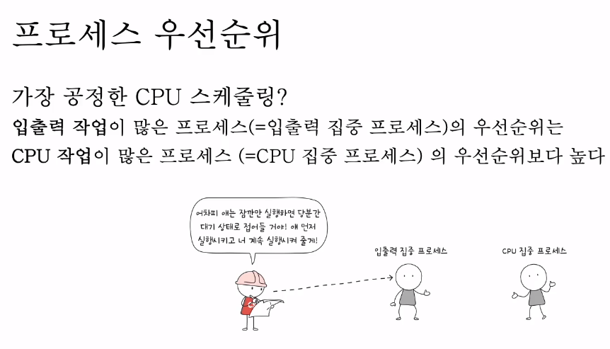
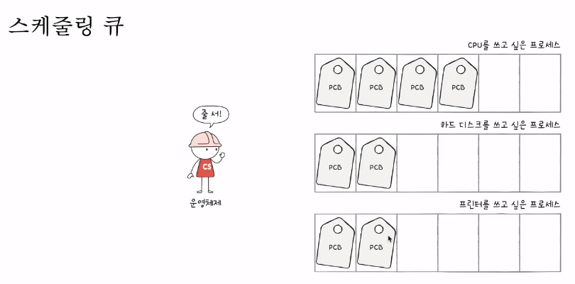
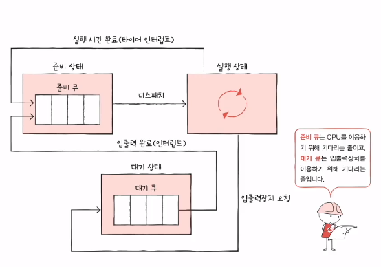

## cpu스케줄링의 의미와 종류
- cpu 스케줄링 : ready queue에 있는 프로세스 중 어느 프로세스에 cpu를 할당할 것인가를 결정하는 문제를 의미한다.

- **입출력 작업이 많은 프로세스(=입출력 집중 프로세스)의 우선순위는 cpu작업이 많은 프로세스(=cpu집중 프로세스)의 우선순위보다 높다.**
- 이유는, 생각해보면 간단한다.
- 입출력 작업이 많은 프로세스는 사용자가 입력하는 것으로 인해, 빠르게 cpu를 내놓게 되고 그 이후,
- cpu를 집중적으로 많이 사용하는 수학연산, 컴파일 작업 등에게 더 많이 cpu를 할당할 수 있도록 하는것!

- 프로세스의 우선순위는 pcb에 저장이 된다.

### 스케줄링 큐

- 어느 특정 시점으로부터 여러 프로세드들이 cpu를 점유하고 싶어할텐데, 운영체제는 모든 프로세스의 pcb를 확인하기 굉장히 번거로울 것이다. 
- 그래서 스케줄링 큐에 작업별로 여러 프로세스들이 줄세울 수 있도록 한다.
  - 스케줄링 큐에는 ready queue와 waiting queue가 대표적으로 존재한다.
    - ready queue : cpu를 이용하고자 하는 프로세스들이 서는 줄
    - waiting queue : 입출력장치를 이용하고자 하는 프로세스들이 서는 줄
    - **먼저 큐에 삽입되었다고 해서, 먼저 처리되는 것은 아니다.**
      - **우선순위가 높은 프로세스에 할당이 되는 것임!**

- cpu 스케줄링 종류

- 단기 스케줄러 
  - 어떤 프로세스를 running시킬 것인가
- 중기 스케줄러
  - 어떤 프로세스를 메모리에 디스크로 쫓아낼 것인가
- 장기 스케줄러
  - 어떤 프로세스를 ready queue로 보낼 것인가

- 중기 스케줄러와 장기 스케줄러 모두 degree of multiprogramming을 제어하는데 이때, degree of multiprogramming은 프로세스를 메모리에 얼만큼 올릴 것인가를 의미한다.
- 과거에는 프로세스가 생성이 되고 장기스케줄러에 admitted되어야 ready상태가 될 수 있었다.
- 이 장기 스케줄러로 degree of multiprogamming을 제어하였다.

- 현재는, degree of multiprogramming을 제어하기 위해 중기스케줄러를 두며, 중기 스케줄러를 swapper라고 한다.
