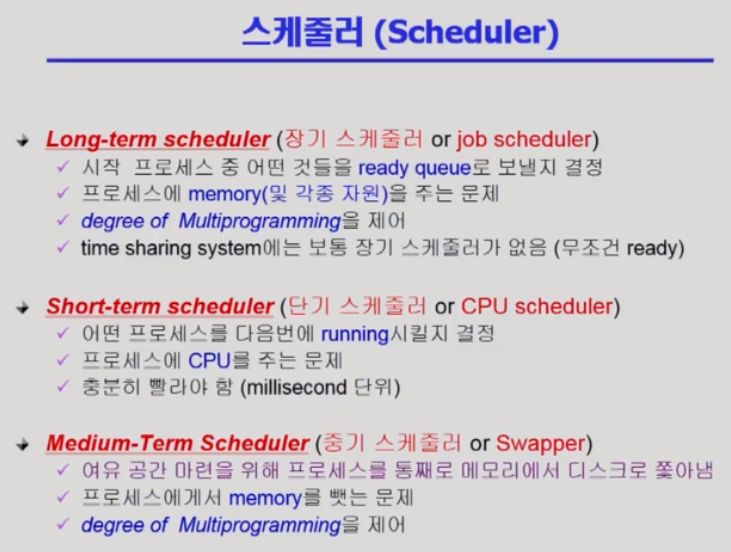

## cpu스케줄링의 의미와 종류
- cpu 스케줄링 : ready queue에 있는 프로세스 중 어느 프로세스에 cpu를 할당할 것인가를 결정하는 문제를 의미한다.

- cpu 스케줄링 종류

- 단기 스케줄러 
  - 어떤 프로세스를 running시킬 것인가
- 중기 스케줄러
  - 어떤 프로세스를 메모리에 디스크로 쫓아낼 것인가
- 장기 스케줄러
  - 어떤 프로세스를 ready queue로 보낼 것인가

- 중기 스케줄러와 장기 스케줄러 모두 degree of multiprogramming을 제어하는데 이때, degree of multiprogramming은 프로세스를 메모리에 얼만큼 올릴 것인가를 의미한다.
- 과거에는 프로세스가 생성이 되고 장기스케줄러에 admitted되어야 ready상태가 될 수 있었다.
- 이 장기 스케줄러로 degree of multiprogamming을 제어하였다.

- 현재는, degree of multiprogramming을 제어하기 위해 중기스케줄러를 두며, 중기 스케줄러를 swapper라고 한다.
