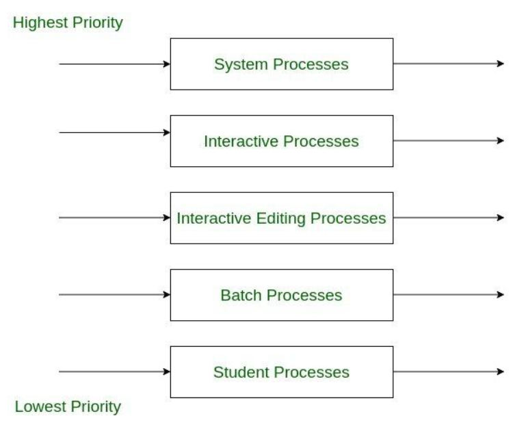
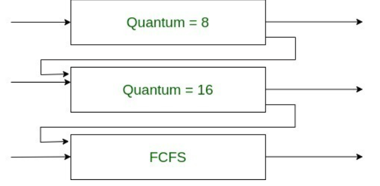

## preemptive / non-preemptive
- preemptive 스케줄링은 어떤 프로세스가 cpu를 할당받아 실행중인 상태에서, 다른 프로세스가 실행중인 프로세스를 중지하고 cpu를 강제로 점유하는 방식
- non-preemptive 스케줄링은 어떤 프로세스가 cpu를 할당받으면 그 프로세스가 종료되거나 입출력 요구에 의해 프로세스가 자발적으로 중지될때까지 계속 실행하는 것

- preemptive 스케줄링
  - 장점 : 어느 한 프로세스의 자원 독점을 막고 프로세스들에게 골고루 자원을 배분할 수 있다.
  - 단점 : 그만큼 context-switch과정에서 overhead가 발생할 수 있다.
- non-preemptive 스케줄링
  - 장점 : 선점형 스케줄링에 비해 context-switch에서 발생하는 오버헤드가 적다.
  - 단점 : 모든 프로세스가 골고루 자원을 이용하기 어렵다.

## non-preemptive
### 선입선출 스케줄링(FCFS, First Come First Service)
- Ready queue에 도착한 순서대로 차례로 cpu를 할당하는 기법
- 아무리 앞의 프로세스 실행시간이 길다고 하더라도, 모든 프로세스에게 순서는 돌아가기때문에 **starvation이 없다.**
- 문제 ) convey effect 발생, 실행시간이 긴 프로세스들에 의해 발생한다.
  - cpu이용시간이 긴 프로세스에 의해 사용시간이 짧은 프로세스들이 오래 기다리는 현상

### 최단 작업 우선 스케줄링(SJF, Shortest Job First)
- Ready queue에 기다리고 있는 프로세스들 중에서 실행시간이 가장 짧은 프로세스에게 먼저 cpu를 할당
- 문제 )
  - starvation이 발생할 수 있다. 상대적으로 cpu를 오래 점유하는 프로세스는 starvation이 발생

### HRN(Highest Response-ratio Next)
- 실행시간이 긴 프로세스에 불리한 SJF기법을 보완하기 위한 것으로, 대기시간과 서비스시간을 이용하는 기법을 의미한다.
- 우선순위 계산 공식을 이용하여 서비스 시간이 짧은 프로세스나 대기시간이 긴 프로세스에게 우선순위를 주어 cpu를 할당하는 기법

## preemptive
### SRTF(Shortest Remaining Time First)
- 새로운 job이 들어왔을때, 각 task의 남은 시간을 따져보고 가장 짧은 프로세스에게 cpu를 할당해주는 방식
- 문제 ) 
  - starvation이 발생할 수 있다. 가장 오래 남은 시간의 프로세스는 계속 오래 기다릴 것이다.

### Round Robin
- 시분할 시스템을 위해 설계된 선점형 스케줄링의 하나로, 프로세스들 사이에 우선순위를 두지 않고 순서대로 시간단위로 cpu를 할당하는 방식
- 컴퓨터 자원을 사용할 수 이는 기회를 프로세스들에게 공정하게 부여하기 위한 방법

- time slice가 너무 짧으면, context switching에 대한 overhead가 크다.
- time slice가 너무 길면, 대기하는 프로세스들이 지연될 수 있다.
- 장점 ) 
  - startvation이 없다.

- 참고 블로그
  - https://myallinone.tistory.com/entry/%EB%9D%BC%EC%9A%B4%EB%93%9C-%EB%A1%9C%EB%B9%88Round-Robin-%EC%8A%A4%EC%BC%80%EC%A4%84%EB%A7%81-%EC%95%8C%EA%B3%A0%EB%A6%AC%EC%A6%98
  - https://ddongwon.tistory.com/31

### multi-level queue

- ready queue를 여러개로 분할해 관리하는 스케줄링 기법을 말한다.
  - 우선순위 높음                                     우선순위 낮음
    - 시스템 프로세스 > 대화형 프로세스 > 편집 프로세스 > 일괄처리 프로세스 
- 멀티레벨 큐에서는 대화형 작업을 담기 위한 전위큐(foreground queue)와 계산 위주의 작업을 담기 위한 후위 큐(background queue)로 분할하여 운영된다.
- foreground queue에서는 응답시간을 짧게하기 위해 RR을 사용하는 반면, 
- background queue에서는 FCFS스케줄링 기법을 이용해 context switching에 대한 overhead를 줄인다.
- 그룹별 큐의 프로세스들은 다른 준비상태로 이동할 수 없다.
- 하위 단계 큐에 있는 프로세스를 실행하는 중 상위 단계 큐에 작업이 들어오면, 하위 단계 작업을 멈추고 cpu는 상위단계의 작업을 처리하게 된다.

- 참고블로그
  - https://sunny-jang.tistory.com/32

### multi-level-feedback queue

- 여러 큐에 줄을 세운다는 점에서 multi-level queue와 유사하나, 프로세스가 하나의 큐에서 다른 큐로 이동이 가능하다.
- 위 그림에서, 상위 2개의 큐는 각각 할당시간이 8과 16인 RR스케줄링을 사용한다.
- 세번째 큐는 FCFS스케줄링 기법을 사용한다.

- 프로세스가 ready queue에 도착하면 우선순위가 가장 높은 queue에 줄을 선다.
- cpu이용시간이 짧은 프로세스는 작업이 완료되고, 작업이 완료되지 않은 프로세스들은 할당시간이 16인 두번째 queue로 내려가서 줄을 선다.
- 두번째 queue에서도 작업이 완료되지 않으면, 계산 위주의 프로세스로 간주되어 최하위 queue로 이동하고 FCFS스케줄링을 적용받는다.
- MLFQ는 상위 queue가 비었을 때 다음 하위 큐가 cpu를 할당받는 구조이다.

### 우선순위 스케줄링 (preemptive, non-preemptive)
- ready queue에 프로세스가 도착하면, 도착한 프로세스의 우선순위와 현재 실행중인 프로세스의 우선순위를 비교하여 우선순위가 가장 높은 프로세스에 할당하는 방식
- 선점형, 비선점형 둘다 설계가 가능하다.
- 우선순위가 낮은 프로세스가 높은 프로세스에 의해 실행이 되고 있지 않은 상황이라면, 그 프로세스의 우선순위를 점차 높여 처리받게끔 하는 **aging**기법을 사용한다.
- 장점 ) 
  - 각 프로세스의 중요도에 따라 작업을 수행하기 때문에 합리적이다.
- 단점 ) 
  - 높은 우선순위를 갖는 프로세스가 계속적으로 스케줄링이 되면, 우선순위가 낮은 프로세스는 자원을 할당받지 못하기 떄문에 기아가 발생할 수 있다.

- 참고 블로그
  - https://reakwon.tistory.com/132

