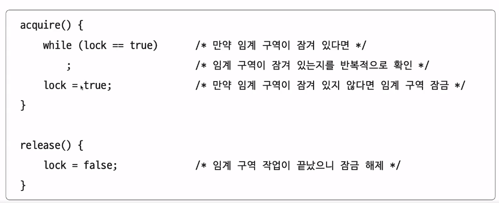
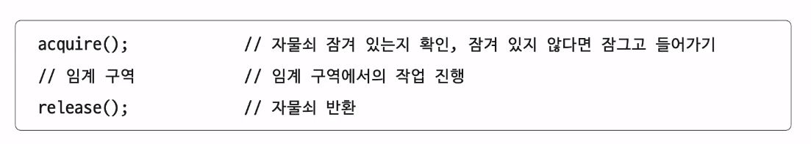
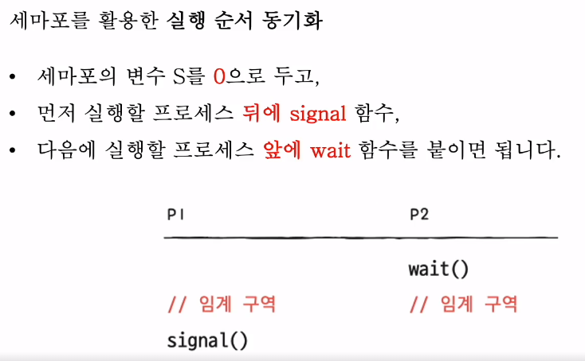
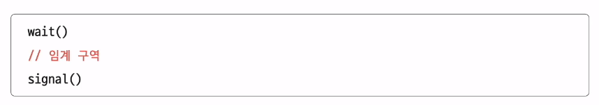
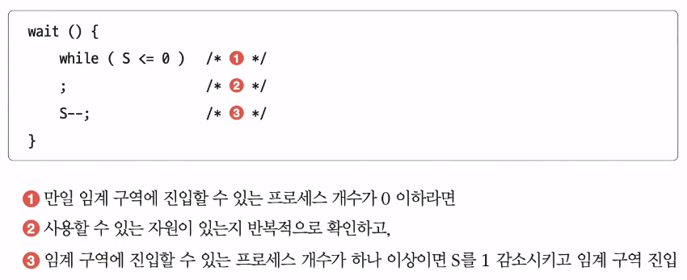
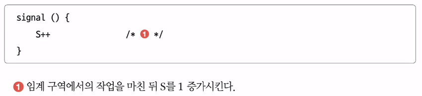
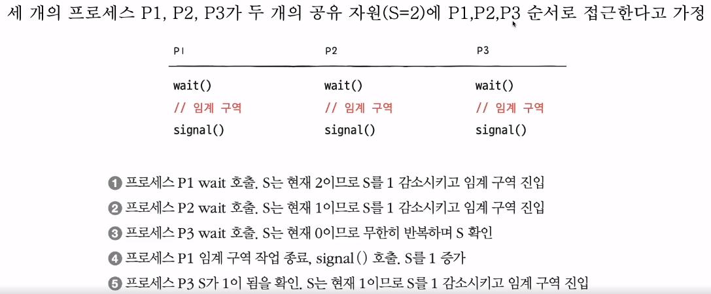
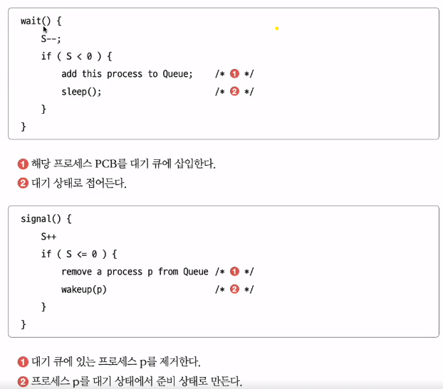
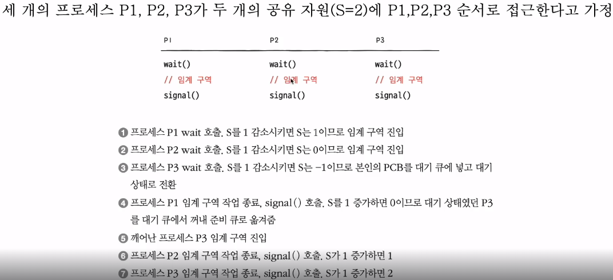

## 동기화를 이해하기 위해 필요한 용어
- **race condition(경쟁 조건)**
  - 여러 프로세스 혹은 여러 스레드가 **동시에 같은 데이터를 조작할 때** 타이밍이나 접근 순서에 따라 **결과가 달라질 수 있는 상황**
    - 이를 해결하기 위해 mutal exclusion을 이용하자!
- **synchronization(동기화)**
  - 여러 프로세스 혹은 여러 스레드를 동시에 실행해도 **공유 데이터의 일관성을 유지하는 것**
  - 실행 순서 제어를 위한 동기화 : 프로세스를 올바른 순서대로 실행하기
  - 상호 배제를 위한 동기화 : 동시에 접근해서는 안되는 자원에 하나의 프로세스만 접근하게 하기
- **critical section(임계 영역)**
  - 공유 데이터의 일관성을 보장하기 위해 **하나의 프로세스 혹은 하나의 스레드만 진입(=mutal exclusion)해서 실행 가능한 영역**
  - mutal exclusion을 하기 위해 lock을 사용한다.

## 상호 배제를 위한 동기화에 대한 세 가지 원칙
- 상호배제(mutual exclusion)
  - 한 프로세스가 임계 구역에 진입했다면 다른 프로세스는 진입할 수 없다.
- 진행(progress)
  - 임계구역에 어떤 프로세스도 진입하지 않았다면, 진입하고자 하는 프로세스는 들어갈 수 있어야한다.
- 유한대기(bounded waiting)
  - 한 프로세스가 임계 구역에 진입하고 싶다면, 언젠가는 임계 구역에 들어올 수 있어야한다.

## spin lock
- critical section에 진입할 때까지 cpu를 놓지 않고 계속해서 lock의 취득을 시도하는 busy waiting방식으로 구현된다.
  - busy waiting
    - 원하는 자원을 얻기 위해 기다리는 것이 아니라 계속해서 확인하는 것
- 단점
  - lock을 기다리는 동안 busy waiting으로 인해 cpu를 계속해서 낭비한다는 단점이 발생한다.

## Mutex
- **lock을 가질 수 있을 때까지 휴식한다.** 즉, lock을 요청한 후 취득할 때까지 cpu를 소모하지 않고 wait queue에 잠들게 된다.
- **unlock과 lock의 주체가 서로 같아야한다.**
- priority inheritance를 가짐.
  - priority inheritance
  - 우선순위 스케줄링이고, P1(우선순위 높음)과 P2(우선순위 낮음)가 있는 상황에서, P2가 lock을 먼저 쥔 상황이라고 가정하자.
  - p1이 lock을 쥐려고하는데 p2에 의해서 실행이 안됨. 우선순위가 높은데도 불구하고 p2에 의해 계속 기다리는 상황이 발생한다.
  - mutex는 이 상황을 어떻게 해결하냐?
    - p2를 p1만큼 우선순위를 높여 lock을 반환할 수 있도록 한다. (=이것이 priority inheritance라고 함.)

- acquire()
  - 프로세스가 임계구역에 진입하기 전에 호출하는 함수로
  - 임계 구역이 잠겨있다면(lock=true), 임계 구역이 열릴때까지 임계 구역을 반복적으로 확인
  - 임계 구역이 열려있다면(lock=false), 임계 구역을 잠그기

- release()
  - 임계 구역에서의 작업이 끝나고 호출
  - 현재 잠긴 임계 구역을 열기(lock을 false로!)

- while문의 (lock=true) -> busy waiting방식임.

## Mutex가 Spin lock보다 항상 좋은걸까?
- spin lock이 더 좋은 경우
  - **multi core환경**이고 **critical section의 작업이 context-switching**(mutex가 lock을 잠들고 있다가 깨는 과정에서 context switching이 발생함)**보다 더 빨리 끝난다면, spin lock이 mutex보다 더 좋다.**
  - single core가 안되는 이유
    - t1스레드가 critical section에서 작업을 하고있다고 가정하자. 다른 t2스레드가 spin lock을 통해 진입을 하려고 하면 결국 single core에서는 context swtich가 일어날 수 밖에 없다!
  - multi core환경어야하는 이유
    - cpu를 하나 쥔 t1스레드가 critical section에서 작업을 하고있다고 가정하자. 다른 cpu를 쥔 t2스레드가 spin lock을 통해 lock을 취득할 수 있음을 알게 되었다. 이때, context-switching보다 더 빨리 끝난다면 spin lock이 더 좋을 수 밖에 없다.

- 위를 정리하면, 아래와 같다.
- 금방 임계 구역에 진입이 불가능한 경우
  - 수행가능한 다른 프로세스가 수행되고 있을 수 있도록 cpu를 낭비하지 않는 semaphore나 mutex가 효율적이다.
- 금방 임계 구역에 진입이 가능한 경우
  - 프로세스가 잠들어있다가 깨어나는 context-switch이 필요없는 spin lock이 더 효율적이다.

## Semaphore
- signal mechanism을 가진, 하나 이상의 프로세스/스레드가 critical section에 접근 가능하도록 하는 장치
- **lock의 주체(=wait)와 unlock(=signal)의 주체가 서로 달라도 된다.**
  - 즉, lock(=wait)의 동시접근만을 제어할 뿐, **unlock(=signal)의 주체가 lock을 취득한 프로세스인지는 확인하지 않는다.**
- 순서를 정해줄 때 사용한다.

- 위와 같이 실행하면, 무조건 p1 -> p2순으로 실행됨.

- **binary semaphore (이진 세마포어)**
  - **critical section에 동시 진입을 허용할 프로세스의 수에 따라 1개만 허용**
- counting semaphore (계수 세마포어)
  - critical section에 동시 진입을 허용할 프로세스의 수에 따라 1개보다 더 많이 허용

- S(전역변수) : 임계구역에 진입할 수 있는 프로세스의 개수

- wait() : 임계구역에 들어가도 좋은지, 기다려야할 지 알려주는 함수

- signal() : 임계구역을 기다리는 프로세스에, '이제 가도 좋다'고 신호를 알려주는 함수

- while(S <= 0) 역시 busy waiting으로 구현되고 있음.

busy waiting방식은 좋지 않다! 따라서, 아래와 같이 해결한다.

- 사용할 수 있는 자원이 없을 경우, 대기 상태로 만듬 (해당 프로세스의 pcb를 대기 큐에 삽입)
- 사용할 수 있는 자원이 생겼을 경우, 대기큐의 프로세스를 준비상태로 만듬 (해당 프로세스의 pcb를 대기 큐에서 꺼내 준비 큐에 삽입)

## binary semahphore와 mutex의 차이? 
- lock과 unlock의 주체가 같냐, 다르냐?
- priority inheritance를 가지냐, 갖지 않냐?

## mutex와 semaphore를 각각 언제 사용하면 좋은가?
- mutal exclusion만 필요한 경우에는 mutex를 사용하라!
- 작업간의 실행 순서 동기화가 필요하다면 semaphore를 사용하라!

- 참조블로그
  - https://hexoul.github.io/mutex
  - https://www.youtube.com/watch?v=gTkvX2Awj6g
