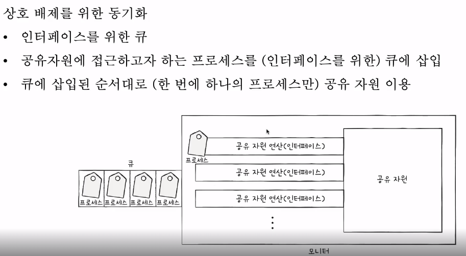
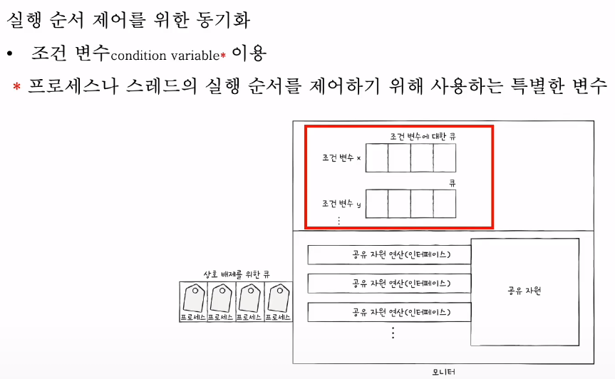

## monitor
- 실행 순서를 위한 동기화 및 상호 배제를 위한 동기화에 대해 모두 제공한다.

- 상호배제를 위한 동기화

- 실행순서를 위한 동기화

- 조건변수.wait() : 대기상태로 변경한다. 조건 변수에 대한 큐에 삽입
- 조건변수.signal() : wait()로 대기 상태로 접어든 조건 변수를 실행 상태로 변경

- 모니터 안에는 하나의 프로세스만이 있을 수 있다.
  - 모니터는 2가지 방식으로 구현가능하다.
    - 1. wait()를 호출했던 프로세스는 signal()를 호출한 프로세스가 모니터를 떠난 뒤에 수행을 재개하는 방식으로 구현가능하다.
    - 2. signal()를 호출한 프로세스의 실행을 일시 중단하고 자신이 실행한 뒤, 다시 signal()를 호출한 프로세스의 수행을 재개하는 방식으로 구현가능하다.