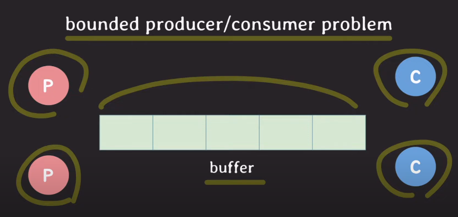
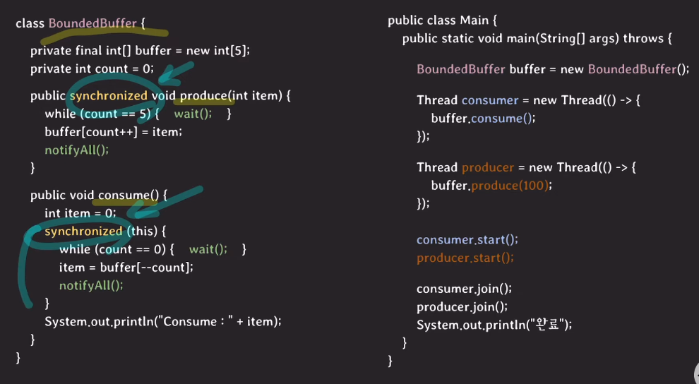

## monitor
- 실행 순서를 위한 동기화 및 상호 배제를 위한 동기화에 대해 모두 제공한다.
- **mutual exclusion을 보장한다.**
- **조건에 따라 스레드가 대기(waiting)상태로 전환 가능하다.**
- **monitor에는 두개의 큐가 존재한다.**
  - entry queue : critical section에서 진입을 기다리는 큐로서, mutex에 의해 관리된다.
  - waiting queue : 조건이 충족되길 기다리는 큐로서, condition variable에 의해 관리된다.
- 프로그래밍 언어 레벨에서 지원하는 것임!

- 구성요소
  - **mutex**
    - critical section에서 mutual exclusion을 보장하는 장치로 
    - critical section에 진입하려면 mutex lock을 취득해야한다.
    - mutex lock을 취득하지 못한 스레드는 큐에 들어간 대기(waiting)상태로 전환한다.
    - mutex lock을 쥔 스레드가 lock을 반환하면, lock을 기다리며 큐에 대기 상태로 있던 스레드 중 하나가 실행된다.
  - **condition variable(s)**
    - waiting queue를 가진다.
    - 이때, waiting queue는 조건이 충족되길 기다리는 스레드들이 대기상태로 머무는 곳을 의미한다.
    - wait동작
      - thread가 자기 자신을 condition variable의 waiting queue에 넣고 대기 상태로 전환하는 동작을 의미한다.
    - signal동작
      - waiting queue에서 대기중인 스레드 중 하나를 깨운다.
    - broadcast동작
      - waiting queue에서 대기중인 스레드 전부를 꺠우는 것을 의미한다.

- monitor는 아래와 같은 문제를 해결해준다.

- producer는 buffer가 다 찼는지를 계속해서 확인해야하는 문제, consumer는 buffer가 비었는지를 계속해서 확인해야하는 문제가 있다. 이를 monitor가 해결해준다.

## 자바에서의 monitor
- 자바에서 모든 객체는 내부적으로 모니터를 하나씩 가진다.
- **모니터의 mutual exclusion기능은 `synchronized키워드`로 사용한다.**
- 자바에서의 모니터는 condition variable를 하나만 가진다! 즉 waiting queue가 하나라는 것을 의미함!
- 자바 모니터의 세가지 동작
  - wait
  - notify (=위에서 살펴본 signal과 같다.)
  - notifyAll (=위에서 살펴본 broadcast와 같다.)

- 참조블로그
  - https://www.youtube.com/watch?v=Dms1oBmRAlo&t=789s