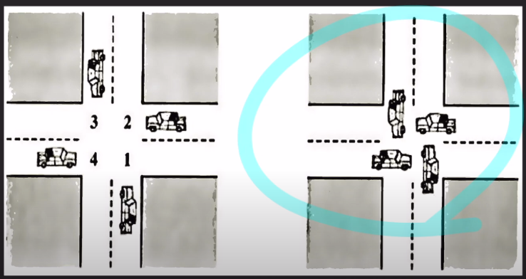
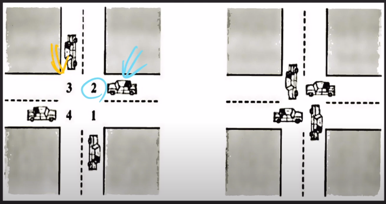
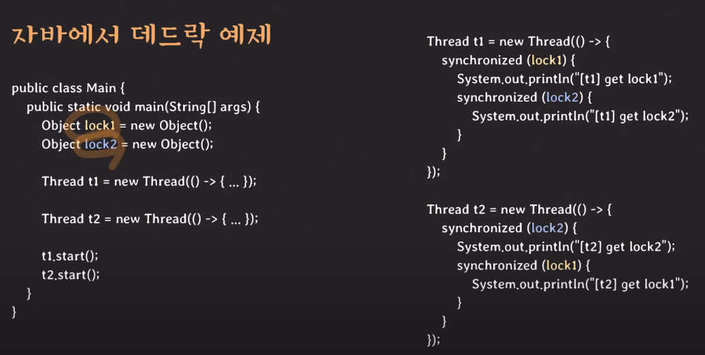

## Deadlock 

- 위 오른쪽 그림이 deadlock임을 말할 수 있다.
- 숫자 1, 2, 3, 4가 리소스이고, 자동차가 프로세스라고 생각해보자. 각 차들은 직진하기 위해 2개의 리소스를 점유해야한다. 각 차들이 마음이 급해 자원을 하나 점유는 하였으나, 그 외에 리소스들은 각 다른 차량들이 점유하고 있어 교착상태에 빠지게 되어 계속 하염없이 기다리게 되었다. (=deadlock)
- 즉, **두 개 이상의 프로세스 혹은 스레드가 서로가 가진 리소스를 기다리는 상태**를 의미한다.

## Deadlock이 발생하기 위한 4가지 조건, 4가지 조건이 모두 만족해야 deadlock이 발생한다.
- Mutual Exclusion
  - 리소스를 공유해서 사용할 수 없다.
- Hold and Wait
  - 프로세스가 이미 하나 이상의 리소스를 취득(hold)한 상태에서 다른 프로세스가 사용하고 있는 리소스를 추가로 기다린다(wait)
- No preemption
  - 리소스 반환은 오직 그 리소스를 취득한 프로세스만 할 수 있다.
  - 위 그림의 예에서, 1번 자원을 점유한 차량은, 2번 자원을 빼앗을 수 없다. 이런 상황을 no preemption이라고 함.
- Circular wait
  - 프로세스들이 순환(circular)형태로 서로의 리소스를 기다린다.
  - 위 그림으로 보았을때, 서로가 서로의 자원을 기다리고 있다. 
  - 예를 들면, 3번을 점유한 차량은 4번을 기다리고 있고, 4번을 점유한 차량은 1번을 기다리고 있고.. 순환 형태임!

## Deadlock 해결방법
- **Deadlock prevention (데드락 방지)**
  - 4가지 조건 중 하나가 충족되지 않게 시스템적으로 설계함
  - mutual exclusion 방지
    - 리소스를 공유 가능하게 함
      - 현실적으로 불가능함.
  - **hold and wait 방지**
    - 사용할 리소스들을 모두 획득한 뒤에 시작하거나 리소스를 전혀 가지지 않은 상태에서만 리소스를 요청한다.
      
    - 예를 들어, 위 그림에서, 파랑색으로 표시한 차량은 2번 3번 자원을 미리 점유하도록 한다.
      - 2번을 점유하였다고 가정했을 때, 2번이 오래 걸리는 작업이었다면, 3번 자원은 낭비가 되는 현상이 발생한다. 
    - 혹은, 리소스를 전혀 가지지 않은 상태에서 2번을 점유한 후, 2번을 반납하도록 하여 다른 차량이 2번을 획득하도록 한다.
      - 2번, 3번 자원 모두 인기가 엄청 많은 것이다. 그래서 계속해서 자원을 얻지 못해 starvation이 발생할 수 있음.
  - **no preemption 방지**
    - 추가적인 리소스를 기다려야한다면 이미 획득한 리소스를 다른 프로세스가 선점 가능하도록 한다
  - **circular wait 방지**
    - 모든 리소스에 순서 체계를 부여해서 오름차순으로 리소스를 요청
    - 위 그림으로 따졌을때, 4번을 점유한 차량은, 4보다 더 큰 자원만 점유하도록 한다. (순서 부여)
    - 가장 현실적인 방법임
- Deadlock Avoidance (데드락 회피)
  - 실행 환경에서 추가적인 정보를 활용해서 데드락이 발생할 것 같은 상황을 회피하는 것
  
  - banker algorithm (데드락 회피를 위한 알고리즘)
    - 리소스 요청을 허락해줬을 때 데드락이 발생할 가능성이 있으면 리소스를 할당해도 안전할 때까지 계속 요청을 거절하는 알고리즘

- 데드락 감지와 복구
  - 데드락을 허용하고 데드락이 발생하면 복구하는 전략
  - 복구할때
    - 프로세스를 종료한다.
    - 리소스의 일시적인 선점을 허용한다.

- 데드락 무시
  - 운영체제에서 데드락을 무시하여 개발자가 알아서 하겠지 ~. 라고 하는 것

## 자바에서 데드락 예제

