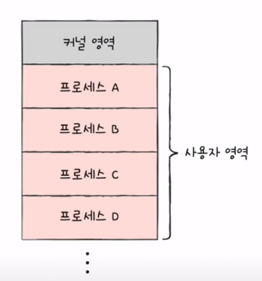
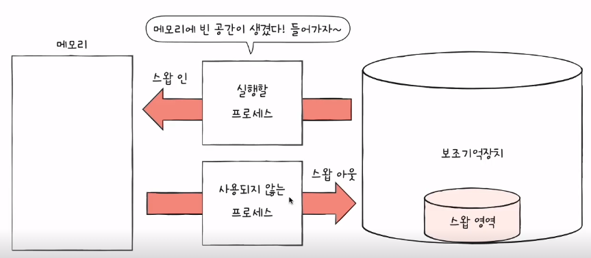
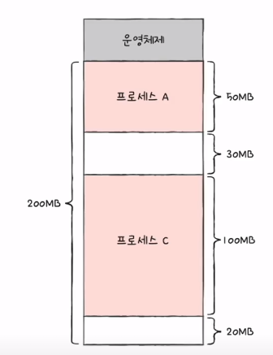

## 연속메모리 할당의 개념과 방식 이에 따른 문제점

**연속 메모리 할당** : **프로세스에 연속적으로 메모리공간을 할당하는 것**을 의미

### swapping (swap out, swap in, cf: 중기스케줄러)

**swapping**
- **현재 사용되지 않는 프로세스들을 보조기억장치의 일부 영역으로 쫓아내고, 쫓아낸 빈 공간에 새 프로세스를 적재하는 것**을 의미한다.
- 장점
  - 여러 프로세스들이 요구하는 메모리 공간의 크기가 실제 RAM메모리의 크키보다 큰 경우에도, 동시에 실행 가능하다.
- swap영역의 크기는 free, top명령어로 확인가능하다.

### 연속 메모리 할당 3가지 방식 (cf: first-fit, best-fit, worst-fit)

- first-fit (=최초적합)
  - 운영체제가 메모리 내의 빈 공간을 순서대로 검색하다가, **적재할 수 있는 공간을 발견하면 바로 그 공간에 프로세스를 배치**하는 방식
  - 장점
    - 검색을 최소화할 수 있으며, 빠른 할당이 가능하다.
- best-fit (=최적적합)
  - 운영체제가 빈 공간을 모두 검색해본뒤, **적재 가능한 가장 작은 공간에 할당**한다.
- worst-fit (=최악적합)
  - 운영체제가 빈 공간을 모두 검색해본 뒤, **적재 가능한 가장 큰 공간에 할당**한다.

### 연속 메모리 할당을 하면 발생하는 문제 -> 외부 단편화

프로세스를 연속적으로 메모리에 할당하는 방식은 메모리를 효율적으로 사용하는 방법이 아니다. 외부 단편화라는 문제가 발생하기 때문이다.

위 그림처럼, 프로세스 B와 D가 실행이 종료되었다고 가정하자. 남은 공간의 총합은 50MB이다. 여기서, 50MB의 프로세스를 실행할 수 있을까? -> NO!

이러한 현상을 외부 단편화라고 한다.

즉, **프로세스를 할당하기 어려울 만큼 작은 메모리 공간들로 인해 메모리 낭비되는 현상**을 의미한다.

### 외부 단편화를 해결하는 방법

- **메모리 압축(compaction)**
  - 여기 저기 흩어져있는 빈 공간을 하나로 모으는 방식으로, **프로세스를 적당히 재배치시켜 흩어져 있는 작은 빈 공간들을 하나의 큰 빈공간으로 만드는 방법**
  - 부작용 발생
    - 프로세스를 재배치하는 과정에서 많은 오버헤드를 야기한다.
- **가상 메모리 기법 (=페이징)** 
  - 현대 운영체제에서 외부단편화를 해결하는 가장 대중적인 방법이다.
