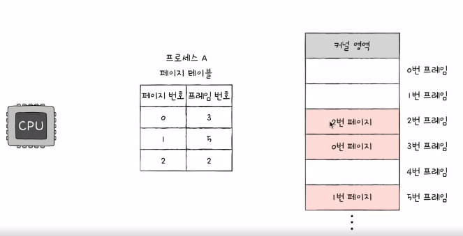
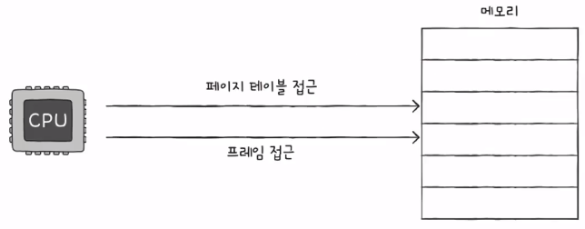
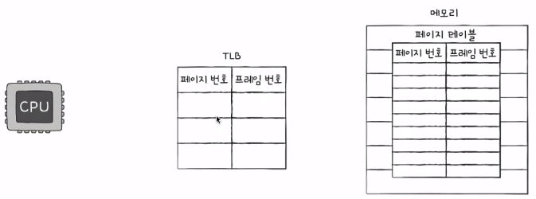
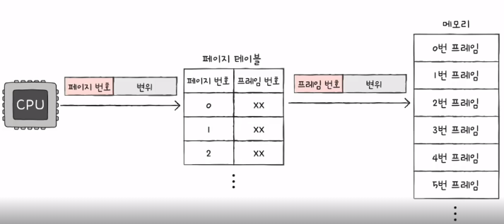
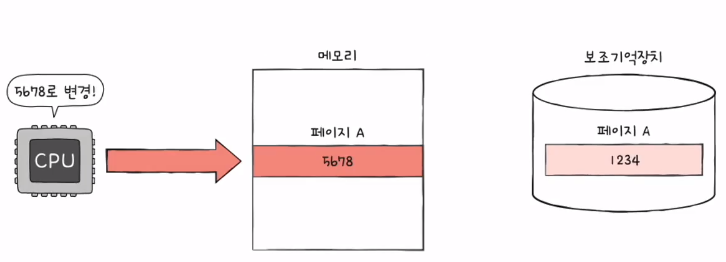

## 페이징을 통한 가상 메모리 관리

### 연속 메모리 할당의 두가지 문제점 
- 외부 단편화의 문제 (=프로세스를 할당하기 어려운 만큼 작은 빈 공간들로 인해 메모리가 낭비되는 현상)
- 물리 메모리보다 더 큰 프로세스 실행이 불가능하다.

### 가상메모리 관리
- **실행하고자 하는 프로세스를 일부만 메모리에 적재하여, 실제 물리메모리보다 더 큰 프로세스를 실행시키는 기술**을 의미한다.
- 가상메모리관리를 해결하기 위한 기술로 페이징, 세그멘테이션 등이 있다.

### 페이징
- **외부 단편화가 발생했던 근본적인 문제**는 **각기 다른 크기의 프로세스**가 **메모리에 연속적으로 할당**되었기 때문
- **페이징은 프로세스를 일정 크기로 자르고, 이를 메모리에 불연속적으로 할당**한다.

- 즉, 페이징은 **프로세스의 논리 주소공간**(=cpu가 바라보는 주소공간)을 **페이지라는 일정단위로 자르고**, 
- **메모리의 물리주소공간(=실제 메모리주소공간)**을 **프레임이라는 페이지와 동일한 일정한 단위**로 자른 뒤,  페이지를 프레임에 할당하는 가상 메모리 관리 기법

- 페이징에서의 스와핑
  - 프로세스 단위로 swap in, swap out이 아닌 페이지 단위로 swap in(=page in), swap out(=page out)
  - 메모리에 적재될 필요가 없는 페이지들은 보조기억장치로 swap out
  - 실행에 필요한 페이지들은 메모리로 swap in
  - 페이징에서의 스와핑은, **프로세스를 실행하기 위헤 그 프로세스를 이루는 모든 페이지가 메모리에 적재될 필요가 없다**는 것을 의미한다.
  - 달리 말해, **물리 메모리보다 큰 프로세스도 실행할 수 있음**을 의미한다.

### 페이지 테이블
- **프로세스를 불연속적으로 할당시 문제점** 
  - 프로세스를 이루는 페이지가 어느 프레임에 적재되어있는지 cpu가 일일이 알기란 어렵다.
  - 프로세스가 메모리에 불연속적으로 배치되어있다면, cpu입장에서 이를 순차적으로 실행할 수 없음.
  - 즉, **cpu입장에서 '다음에 실행할 명령어 위치'를 찾기가 어려워진다.**

- **페이지 테이블**

  - **실제 메모리 주소공간인 물리메모리 주소에 불연속적으로 배치되더라도 cpu가 바라보는 논리주소에는 연속적으로 배치되도록 하는 방법**
  - 즉, **페이지번호와 프레임번호를 짝지어주는 일종의 이정표**(마치 key, value형태로 저장됨)
  - 프로세스마다 페이지테이블이 존재한다.

### 페이징을 통한 부작용, 내부단편화
- 페이지 크기가 10kb이고, 프로세스 크기가 108kb라고 한다면, 2kb는 빈 공간이 발생한다. 이를 내부단편화라고 한다.
- 즉, 페이지 크기 배수만큼 프로세스의 크기가 아닌 경우가 많겠지? -> 그때의 빈공간이 내부단편화임!
- 내부단편화는 메모리의 낭비의 크기가 외부단편화보다 작다!
- pagesize라는 명령어로 페이지크기를 알 수 있다.

### PTBR
- 프로세스마다 페이지테이블이 있고, 각 페이지테이블은 cpu내의 프로세스 테이블 베이스 레지스터가 가리킨다.
- 즉, **PTBR**은 **각 프로세스의 페이지 테이블을 적재된 주소**를 가리키고 있다.

### 만약 페이지테이블이 메모리에 있다면? 접근시간 두배 !

- 페이지테이블을 참조하기 위해 메모리에 접근하고(1), 페이지테이블 내의 페이지의 프레임으로 접근하는 것(2)
- 총 2번 메모리에 접근하므로, 메모리에 접근시간은 두배라고 볼 수 있다.

### TLB(페이지테이블이 메모리에 있다면, 발생하는 접근 시간2배문제를 해결!)

- 위 문제를 해결하기 위한 것으로, **자주 참조되는 페이지 테이블**을 위한 특별한 케시메모리를 의미한다.
- 이를 통해, 불필요한 메모리 접근을 최소화한다.

- cpu가 접근하려는 논리 주소가 TLB에 존재한다면, TLB히트라고 한다. -> 메모리 접근 1번
- 반면, cpu가 접근하려는 논리 주소가 TLB에 없다면, TLB미스라고 한다. -> 메모리 접근 2번

### 페이징에서의 주소변환
- 특정 주소에 접근하고자 한다면, 총 2가지의 정보가 필요하다.
  - 어떤 페이지/프레임에 접근하고 싶은지
  - 접근하려는 주소가 그 페이지 혹은 프레임으로부터 얼마나 떨어져 있는지

- 페이징 시스템에서의 논리주소
  - 페이지 번호 + 변위(그 페이지로부터 얼마나 떨어져있는가)

- 페이징에서의 주소변환, **(페이지, 변위)로 이루어진 논리주소는 페이지 테이블을 통해 (프레임, 변위)로 변환된다.**

### 페이지 테이블에 담기는 정보들

- 페이지, 프레임 외에 다른 정보를 소개해보겠다.

- **유효비트**
  - 현재 해당 페이지에 접근 가능한지 여부 (=현재 페이지가 swap out/swap in되었는지 혹은 **현재 페이지가 메모리에 없는지 있는지**)
  - **유효비트가 0(=현재 페이지가 메모리에 없다)인 페이지에 접근한다면, page fault라는 인터럽트를 발생**시킨다.
    - cpu는 기존의 작업 내역을 백업한다.
    - page fault 인터럽트 처리 루틴을 실행한다.
    - 페이지 처리 루틴은 원하는 페이지를 메모리로 가져온 후, 유효비트를 1로 변경한다.
    - 페이지폴트를 처리했다면, cpu는 해당 페이지에 접근할 수 있게 된다.

- **보호비트**
  - **페이지 보호기능을 위해 존재하는 비트**를 의미한다.
  - 예를 들어, 어떤 페이지는 읽기전용페이지일수도 있고, 읽기/쓰기 모두 가능한 페이지일수도 있다. 쓰미나 가능한 페이지일 수도 있다.
  - 보호비트, 페이지에 접근할 권한을 제한해서 페이지를 보호하는 비트를 의미한다.

- **참조비트**
  - **cpu가 이 페이지에 접근한 적이 있는지 여부**를 의미한다.

- **수정비트(=dirty bit)**

  - **cpu가 이 페이지에 데이터를 쓴 적이 있는지 여부**
  - 수정비트는 페이지가 메모리에 없어질때, 보조기억장치에 쓰기를 할지 말지를 결정한다.
  - 만약, 위 그림처럼, 페이지A는 5678로 파일을 수정하였다면, swap out할때, 보조기억장치에도 쓰기 작업을 통해 반영해야할 것이다! 

