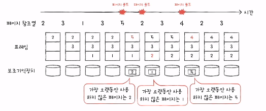

## 페이지교체와 프레임할당

- 물리 메모리보다 더 큰 프로세스를 실행할 수 있지만, **그럼에도 물리 메모리의 크기는 한정되어있다.**
- 그렇기 때문에 운영체제는, 기존에 적재된 불필요한 페이지를 선별해 보조기억장치로 내보내고(=페이지 교체알고리즘), 프로세스들에게 적절한 수의 프레임을 할당(=프레임할당)해야한다.

### 요구페이징
- **요구되는 페이지만 적재하는 기법**으로, 아래 순서대로 실행된다.
  - cpu가 특정 페이지에 접근하는 명령어를 실행한다.
  - 해당 페이지가 현재 메모리에 있을경우(=유효비트가 1일경우), cpu는 페이지가 적재된 프레임에 접근한다.
  - 해당 페이지가 현재 메모리에 없을경우(=유효비트가 0일경우), page fault 인터럽트가 발생한다.
    - page fault처리루틴은 해당 페이지를 메모리로 적재하고 유효비트를 1로 설정한다.
    - 다시 cpu가 특정 페이지에 접근하는 명령어를 실행한다.

cf. 순수 요구 페이징
- 아예 페이지를 메모리에 올리지 않는 기법으로, 이렇게 되면, page fault가 계속 발생하게 된다. 어느 일정 시간이 지나면, page fault가 발생하는 횟수가 떨어지게 된다.

### 페이지 교체 알고리즘(어떤 페이지를 내쫓아야하는지를 결정하는 알고리즘)
- 요구 페이징 기법으로 페이지들을 적재하다보면, 언젠가 메모리가 가득차게 된다.
- 당장 실행에 필요한 페이지를 적재하려면, 이미 적재된 페이지를 보조기억장치로 내보내야한다.
- 이때, 어떤 페이지를 내보내야할까? (=페이지 교체 알고리즘)

- **page fault가 적은 알고리즘**이 **좋은 페이지 교체 알고리즘**이라고 한다.
- **page fault가 자주 발생하면, 보조기억장치에 접근이 자주일어나야해서 성능이 저하된다.**
  - page fault가 자주 발생한다는 것은, 보조기억장치에 내쫓아야할 페이지를 잘 못 골랐다는 것을 의미한다.
  - page fault가 자주 발생하지 않았다면, 보조기억장치에 내쫓아야할 페이지를 잘 골랐음을 의미한다.

- **page reference string(=페이지 참조열)**
  - cpu가 참조하는 페이지 들 중 연속된 페이지를 생략한 페이지 열 (=연속된 페이지들은 page fault가 발생하지 않기 때문에 생략함!)
  - **페이지 참조열을 통해, page fault횟수를 알 수 있다.**

### 페이지 교체 알고리즘 종류

- **FIFO페이지 교체 알고리즘**

    

  - 메모리에 가장 먼저 올라온 페이지부터 내쫓는 방식으로, '**오래 머물렀으면 나가라**'라는 것을 의미한다.
  - 단점
    - 프로그램 실행 내내 사용되어야할 페이지는 먼저 적재되었다고 내쫓아서는 안되는데, 내쫓게 됨.

- **Second-chance 페이지 교체 알고리즘** **(=FIFO의 단점을 보완한 페이지 교체 알고리즘임!)**
  - FIFO와 기본적으로, 메모리에 가장 먼저 올라온 페이지부터 내쫓게 되지만
  - 페이지 참조비트가 1(=cpu가 한번 참조한 적이 있는 페이지)이면, 바로 내쫓지 않고 적재된 시간을 '현재 시간'으로 설정하여, 가장 최근 적재된 페이지로 변경한다.
  - (= **fifo와 다르게 한번 더 기회를 주게 됨**)

- **최적 페이지 교체 알고리즘**
  
    

  - **앞으로의 사용빈도**가 **가장 낮은 빈도를 교체**하는 알고리즘
  - 단점
    - 구현이 어렵다 (앞으로 오랫동안 사용되지 않을 페이지를 예측하기 어렵기때문)

- LRU(Least-Recently-Used) 페이지 교체 알고리즘

    

  - **가장 오랫동안 사용되지 않은 페이지를 교체**하는 알고리즘
  - 최근에 사용되지 않은 페이지는 앞으로도 사용되지 않을까? 라고 생각함.

## Thrashing

- **page fault가 자주 발생하는 이유**는, 크게 2가지로 나눌 수 있다.
  - 나쁜 페이지 교체 알고리즘을 사용하였 때문
  - **프로세스가 사용될 수 있는 프레임 자체가 적기 때문**
  - **프로세스가 실행되는 시간보다 페이지 교체에 더 많은 시간을 소요하여 성능(=cpu 이용률)이 저해되는 문제**를 thrashing이라고 한다.

- thrashing을 그래프로 표현하면 아래와 같다.

- 동시에 실행되는 프로세스를 늘린다고 하여서 cpu이용률이 높아지는 것은 아니다. 
- 왜냐하면 페이지 교체가 자주 일어나기 때문!

- **thrashing이 발생하는 원인**은 아래와 같다.
  - **각 프로세스가 필요로 하는 최소한의 프레임 수를 보장해주지 않았기 때문!**
  - 따라서, 운영체제는 각 프로세스가 필요로 하는 최소한의 프레임 수를 파악하고 프로세스들에게 적절한 프레임을 할당해야한다.

## 프레임 할당 종류
- 정적할당 방식(=프로세스의 실행과정을 고려하지 않고 프로세스의 크기만을 고려함)
  - 균등할당(equal allocation)
    - 가장 단순한 할당방식
    - 모든 프로세스들에게 균등하게 프레임을 할당하는 방식
    - 실행되는 프로세스의 크기는 각기 모두 다를텐데, 균등하게 프레임을 할당하는 것은 비합리적이다!

  - 비례할당(proportional allocation)
    - 프로세스 크기에 비례하여 프레임을 할당하는 방식
    - 크기가 큰 프로세스임에도 막상 실행해보니, 많은 프레임을 필요로 하지 않는다면 좋지 않을 것이다!
    - 반대로, 크기가 작은 프로세스인데, 막상 실행해보니 많은 프레임을 필요로 한다면 > 이때도 좋지 않을 것이다!
    - 결국 프로세스가 필요로 하는 프레임 수는 실행해봐야 안다!

- 동적할당 방식(=프로세스가 실행하는 과정에서 배분할 프레임을 결정하는 방식)
  - 작업집합(=실행 중인 프로세스가 일정시간동안 참조한 페이지의 집합) 방식
    - **cpu가 특정 시간동안 주로 참조한 페이지 개수만큼 프레임을 할당**한다.
    - 즉, 프로세스가 일정기간동안 참조한 페이지 집합을 기억하여, 빈번한 페이지 교체를 방지하는 방식이다.
    - 작업집합을 구하려면, 
      - 프로세스가 어떤 페이지를 참조하였는지
      - 시간간격이 어떠하였는지 를 알아야한다.

  - page fault빈도
    
        

    - page fault율이 너무 높으면, 그 프로세스는 너무 적은 프레임을 갖고 있을 것이다.
    - page fault율이 너무 낮으면, 그 프로세스가 너무 많은 프레임을 갖고 있을 것이다.
    - 따라서, **page fault율의 상한선과 하한선을 정하고, 그 내부 범위 안에서만 프레임을 할당하는 방식**을 의미한다.

