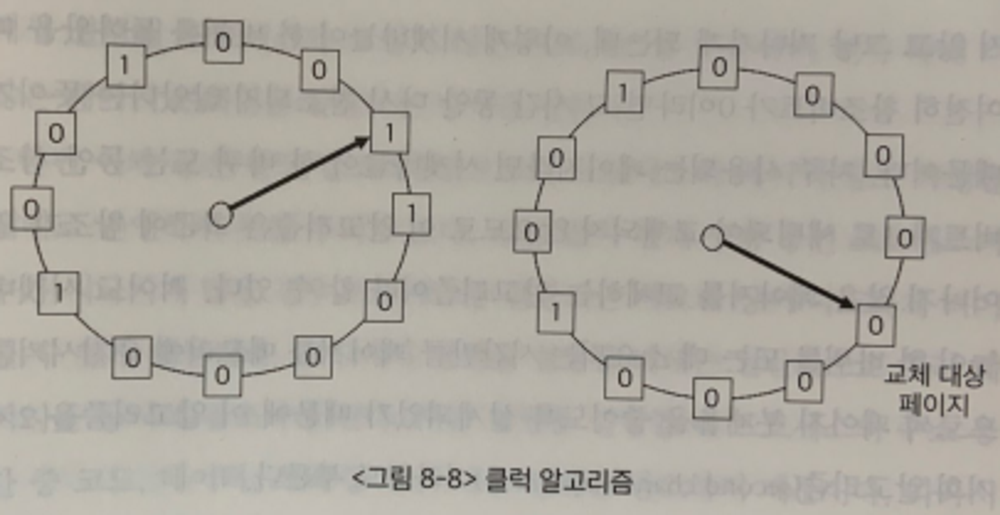

## 절대 주소 지정과 상대 주소 지정 
- 절대 주소 지정
  - 데이터가 위치한 메모리의 실제 주소를 사용하는 방식
  - 장점 
    - 주소가 명확하고 간단
    - 주소 변환 과정이 필요가 없음
  - 단점
    - 프로그램의 크기가 변경되면 다시 컴파일해아함
- 상대 주소 지정
  - 데이터가 위치한 메모리의 상대적인 위치를 사용하는 방식
  - 장점
    - 프로그램의 크기가 변경되어도 다시 컴파일할 필요가 없음
  - 단점
    - 주소가 명확하지 않음

- 참고블로그
  - https://velog.io/@yoonuk/%EC%9A%B4%EC%98%81%EC%B2%B4%EC%A0%9C-%EB%A9%94%EB%AA%A8%EB%A6%AC-%EC%A3%BC%EC%86%8C-%EC%A7%80%EC%A0%95

## 메모리 분할
- 연속 메모리 분할
  - 고정분할
    - 주기억장치가 이미 특정 크기로 고정된 파티션들로 분할되는 방식
    - 장점
      - 원리가 단순하다
    - 단점
      - 파티션 수에 따라 프로세스 수가 제한받는다.
      - 내부단편화 문제가 발생한다.
  - 동적분할
    - 프로세스가 주기억장치로 적재될때 정확히 필요한 크기만큼 할당한다.
    
    - 동적메모리 할당에는 대표적으로 3가지 방식이 있다.
      - 최초적합
        - 운영체제가 메모리 내의 빈 공간을 순서대로 검색하다가, **적재할 수 있는 공간을 발견하면 바로 그 공간에 프로세스를 배치**하는 방식
      - 최적적합
        - 운영체제가 빈 공간을 모두 검색해본뒤, **적재 가능한 가장 작은 공간에 할당**한다.
      - 최악적합
        - 운영체제가 빈 공간을 모두 검색해본 뒤, **적재 가능한 가장 큰 공간에 할당**한다.

    - 장점
      - 내부 단편화 문제는 발생하지 않음
    - 단점
      - 외부 단편화 문제 발생(=프로세스를 할당하기 어려운 만큼, 작은 메모리 공간들로 인해 메모리가 낭비되는 현상)
      - **외부 단편화 문제를 해결하기 위한 방법**
        - **Compaction(압축)**
          - **프로세스를 적당히 재배치시켜 흩어져 있는 작은 빈 공간들을 하나의 큰 빈공간으로 만드는 방법**
        - **Colaescing(통합)**
          - colaescing은 **인접한 빈 영역들을 합치는 방법**이다.
- 불연속 메모리 분할
  - 페이징
    - 페이징은 **프로세스의 논리 주소공간**(=cpu가 바라보는 주소공간)을 **페이지라는 일정단위로 자르고**, **메모리의 물리주소공간**(=실제 메모리주소공간)을 **프레임이라는 페이지와 동일한 일정한 단위**로 자른 뒤,  페이지를 프레임에 할당하는 가상 메모리 관리 기법
  - 세그멘테이션
    - 프로세스를 의미단위의 세그먼트로 나누어 물리 메모리로 올리는 것

## 버디시스템
- 고정분할 기법은 메모리에 적재할 수 있는 프로세스 수가 고정되어있고 내부단편화가 발생할 수 있다는 단점이 있다.
- 가변분할 기법은 외부단편화를 발생시킬 수 있고 이를 해결하기 위해 compaction을 해야한다는 단점이 있다.
- 이에 대한 절충안으로 버디시스템이 있다.
- 큰 버퍼들을 반복적으로 이등분하여 작은 버퍼들을 만들며 가능할때마다 인접한 Free버퍼들을 합치는 과정을 반복한다.
- 외부 단편화를 없애기 위해 사용된다.
- 2의 거듭 제곱으로 올림됭서ㅓ 할당되기 때문에 내부 단편화가 발생한다.

- 참조블로그
  - https://eunajung01.tistory.com/90
  - https://blog.naver.com/klp0712/220883220425

## 가상 메모리 관리
- **실행하고자 하는 프로세스를 일부만 메모리에 적재하여, 실제 물리메모리보다 더 큰 프로세스를 실행시키는 기술**

## 가상 주소와 물리주소
가상 주소 -> cpu가 바라보는 주소
물리 주소 -> 실제 메모리에서 사용되는 주소

## 가상 주소를 물리주소로 변환하는 방법
- MMU기법을 통해 가상 주소를 물리주소로 변환한다.
  - CPU가 특정 프로세스의 논리적 주소를 참조하려고 할때 MMU기법은 그 주소값에 기준 레지스터의 값을 더해 물리적 주소값을 얻어낸다.

## swap out, swap in
**swapping**
- **현재 사용되지 않는 프로세스들을 보조기억장치의 일부 영역으로 쫓아내고, 쫓아낸 빈 공간에 새 프로세스를 적재하는 것**을 의미한다.
- 장점
  - 여러 프로세스들이 요구하는 메모리 공간의 크기가 실제 RAM메모리의 크키보다 큰 경우에도, 동시에 실행 가능하다.
- 단점
  - swapping과정 중에 시스템이 갑자기 종료되면 swap out된 프로세스의 데이터가 손실될 수 있다.

- 참조블로그
  - https://taeyoungcoding.tistory.com/350

## 페이지 교체 알고리즘
- 요구 페이징 기법으로 페이지들을 적재하다보면, 언젠가 메모리가 가득차게 된다.
- 당장 실행에 필요한 페이지를 적재하려면, 이미 적재된 페이지를 보조기억장치로 내보내야한다.
- 이때, 어떤 페이지를 내보내야할까? (=페이지 교체 알고리즘)
- 페이지 부재(=page fault, 프로세스가 요구한 페이지가 현재 메모리에 없는경우)를 최소화하려면, 적절한 페이지 교체알고리즘을 사용해야한다.

- **FIFO페이지 교체 알고리즘**
  - 메모리에 가장 먼저 올라온 페이지부터 내쫓는 방식
  - 단점
    - 프로그램 실행 내내 사용되어야할 페이지는 먼저 적재되었다고 내쫓아서는 안되는데, 내쫓게 됨.
- **LRU(Least-Recently-Used) 페이지 교체 알고리즘**
  - **가장 오랫동안 사용되지 않은 페이지를 교체**하는 알고리즘
- **LFU(Least-Frequently-Used) 페이지 교체 알고리즘**
  - 과거에 참조횟수가 가장 적었던 페이지를 쫓아내는 알고리즘
  - 최저 참조 횟수를 가진 페이지들이 여러개라면, 상대적으로 더 오래된 페이지를 쫓아내도록 구현
- **클럭알고리즘**
  
  

- LRU와 LFU 알고리즘은 페이지의 참조 시각 및 참조 횟수를 소프트웨어적으로 유지하고 비교해야 하므로 알고리즘의 운영에 시간적인 오버헤드가 발생한다.
- 클럭 알고리즘은 하드웨어적인 지원을 통해 이와 같은 알고리즘의 오버헤드를 줄인 방식이다.
- 클럭 알고리즘은 LRU를 근사시킨 알고리즘으로 NUR 또는 NRU 알고리즘으로도 불린다.
- LRU는 ‘가장’ 오래전에 참조된 페이지를 교체하는 것에 비해 클럭 알고리즘은 오랫동안 참조되지 않은 페이지중 하나를 교체한다.
- 위와 같이 클럭 알고리즘은 LRU를 근사시킨 알고리즘으로 볼 수 있다.
- 대부분의 시스템에서 페이지 교체 알고리즘으로 클럭 알고리즘을 채택한다.
- 클럭 알고리즘은 교체할 페이지를 선정하기 위해 페이지 프레임들의 참조비트를 순차적으로 조사한다.
- 참조비트는 각 프레임마다 하나씩 존재하며 그 프레임 내의 페이지가 참조될 때 하드웨어에 의해 1로 자동 세팅 된다.
- 여기서 클럭 알고리즘은 참조비트가 1인 페이지는 0으로 바꾼 후 그냥 지나가고 참조비트가 0인 페이지는 교체한다.
- 모든 페이지 프레임을 다 조사한 경우 첫 번째 페이지 프레임부터 조사 작업을 반복한다.
- 이 방식은 간단히 말해 시계바늘이 한 바퀴 도는 동안 다시 참조되지 않은 페이지를 교체하는 것이다.
- 그림을 통해 더 구체적으로 알아보자
  - 교체 대상 페이지를 찾기 위해 클럭 알고리즘은 메모리에 현재 올라와 있는 페이지의 참조 비트 정보를 시계방향으로 따라가며 조사한다.
  - 시곗바늘이 가리키는 페이지의 참조 비트가 1인 경우 클럭 알고리즘은 참조비트를 0으로 바꾼 후 시곗바늘을 한 칸 진행시키고 참조비트가 0인 페이지를 찾으면 그 페이지를 교체한다.
  - 한 편 참조비트는 그 페잊가 참조 될 때 1로 자동 세팅되므로 시곗바늘이 한 바퀴 돌아오는 동안에 다시 참조되지 않을 경우 그 페이지는 교체된다.
  - 이는 참조 비트가 1인 페이지는 0으로 바꾼 후 교체하지 않고 그냥 지나가게 되는데,
  - 이렇게 시곗바늘이 한 바퀴를 돌아왔을 때 여전히 참조 비트가 0이라면, 그 시간 동안 다시 참조되지 않았다는 뜻이기 때문이다.
  - 자주 사용되는 페이지라면 시곗바늘이 한 바퀴 도는 동안 참조비트가 1로 세팅되어 교체되지 않으므로 이 알고리즘은 최근에 참조가 일어나지 않은 페이지를 교체하는 알고리즘이라 할 수 있다.
  - 적어도 시곗바늘이 한 바퀴를 도는 데 소요되는 시간만큼 페이지를 메모리에 유지시켜줌으로써 페이지 부재율을 줄이도록 설계되었기 때문에 이 알고리즘을 2차 기회 알고리즘이라고도 부른다.

## Thrashing
- **프로세스가 실행되는 시간보다 페이지 교체에 더 많은 시간을 소요하여 성능(=cpu 이용률)이 저해되는 문제**를 thrashing이라고 한다.

## 워킹 알고리즘
- **cpu가 특정 시간동안 주로 참조한 페이지 개수만큼 프레임을 할당**한다.
  - 즉, 프로세스가 일정기간동안 참조한 페이지 집합을 기억하여, 빈번한 페이지 교체를 방지하는 방식이다.
  - 작업집합을 구하려면,
    - 프로세스가 어떤 페이지를 참조하였는지
    - 시간간격이 어떠하였는지 를 알아야한다.

## page fault빈도
- page fault율이 너무 높으면, 그 프로세스는 너무 적은 프레임을 갖고 있을 것이다.
  - page fault율이 너무 낮으면, 그 프로세스가 너무 많은 프레임을 갖고 있을 것이다.
  - 따라서, **page fault율의 상한선과 하한선을 정하고, 그 내부 범위 안에서만 프레임을 할당하는 방식**을 의미한다.